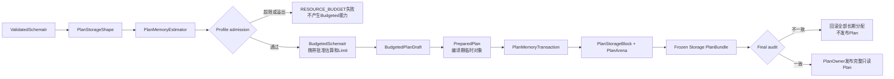

# PAE-DEC-033A Plan计费内存实施切片方案

## 1. 文档控制

| 项目 | 内容 |
| --- | --- |
| 文档版本 | 0.2.0 |
| 日期 | 2026-09-02 |
| 状态 | `IMPLEMENTED / WINDOWS PARTIALLY VERIFIED（已实现 / Windows部分已验证）` |
| 对应决策 | `PAE-DEC-033A`冷Plan长期内存计量与单Plan准入 |
| 前置基线 | `PAE-DEC-031` Frozen Execution Plan；`PAE-DEC-032`不可伪造Validated/Budgeted能力链 |
| 本文性质 | 内部实施切片和验证计划，不是稳定公共API或ABI规范 |

本文最初作为第十七轮实施评审输入；用户确认四项选择并授权后，当前内部切片已落地。Windows实际执行证据见`windows-msvc-2026-accounted-plan-memory-slice.md`。本状态不包含`PAE-DEC-033B`、Linux、稳定公共API/ABI、正式性能或生产规模容量验证。

## 2. 当前实现事实与保留边界

截至2026-09-02，当前仓库具有以下实现事实：

- `ResourceBudgetValidator`在计数门禁之后计算最终Plan的精确分类布局，超限时不产生`BudgetedSchemaIr`；
- `BudgetedSchemaIr`和`BudgetedPlanDraft`私有载荷携带批准`PlanMemoryReport`和有效Limit；
- Compiler临时Draft/Prepared仍使用`std::string/std::vector`，不计入长期Plan；
- 最终Plan使用`FrozenString/FrozenArray`，`PlanArena`在一个`PlanStorageBlock`中分类布局所有长期对象；
- `PlanOwner`取代默认`unique_ptr<PlanBundle>`所有权，Codec仍只消费`const PlanBundle&`；
- Builder对Prepared Plan重新估算，并强制批准报告、Builder估算和最终Arena报告逐字段一致；
- 当前仍没有Runtime/Session聚合准入、稳定公共Allocator入口或跨平台执行证据。

实施中没有单独创建`PlanMemoryTransaction`或`PlanStorageShape`类：事务回滚由局部Frozen对象、`PlanStorageBlock`和`PlanOwner`的RAII语义完成；ResourceBudget与Builder分别枚举布局，共用`PlanMemoryLayout`的受检算术和对齐规则，并以Builder发布前的逐字段完全相等作为漂移门禁。

## 3. 目标和非目标

### 3.1 本切片目标

1. 为最终不可变Plan建立单一、受检、可故障注入的内部Accounting Allocator（计费分配器）；
2. 在`ResourceBudgetValidator`阶段形成精确`PlanMemoryEstimate（Plan内存估算）`并完成单Plan准入；
3. 让估算和Allocator使用同一套布局规则，最终`accounted_total_bytes`必须与批准估算完全相等；
4. 让Plan对象、字符串、Matcher、冷元数据数组、热执行描述符、索引、扩展占位和PAE主动对齐全部进入计量；
5. 任意超限、溢出、分配失败或最终审计不一致均不交付部分Plan，并把全部长期分配清零；
6. 发布后的Plan只读、无lazy allocation（延迟分配），现有Codec（编解码器）热路径零分配门禁保持成立；
7. 输出内部`PlanMemoryReport（Plan内存报告）`，供测试、诊断和未来`PAE-DEC-033B` Runtime准入消费。

### 3.2 本切片不做

- 不实现Runtime、Session、共享Plan计数、并发总量准入或退款；
- 不新增Transport、线程、Qt、Boost或平台专属内存API；
- 不冻结稳定公共Allocator API、C ABI（C应用二进制接口）或Plan二进制布局；
- 不新增协议字段、Framing、Integrity、Receive Gate或Mapping能力；
- 不测量Parser/Compiler峰值临时内存；
- 不宣称Linux、嵌入式、硬件、现场或生产性能已经验证。

## 4. 推荐总体设计



图只表达职责和失败方向，不冻结具体C++类名。

### 4.1 采用精确Frozen Storage，而不是事后容量推断

推荐把最终Plan长期存储改为内部精确大小结构：

- `FrozenString`：从Plan专属连续Arena（内存区）取得确定长度的字符区，发布后只暴露`std::string_view`或等价只读视图；
- `FrozenArray<T>`：从同一Arena取得恰好`count * sizeof(T)`的连续区，完成构造后不可扩容；
- `ArrayView<T>`：只读`data + size`视图，支持Codec当前所需的`size()`、索引和迭代；
- 最终`FramingPlan`、`PipelinePlan`、`MessagePlan`、`FieldPlan`及执行描述符使用上述内部存储；
- `PlanDraftData`和`PreparedPlan`继续使用普通标准容器，它们属于Compiler临时内存，不进入Plan长期计费。

不推荐仅把现有容器机械替换为`std::pmr::vector/string`：标准只保证`reserve(n)`后的capacity不少于`n`，没有跨实现承诺完全等于`n`；嵌套Allocator传播和工具链容量策略会使“估算必须等于最终计量”变得脆弱。`std::pmr`仍可用于以后不要求精确布局的内部临时对象，但不作为033A最终Plan存储的首选。

### 4.2 内部计量对象

建议增加以下内部语义类型，名称可在实现时微调：

| 类型 | 职责 |
| --- | --- |
| `PlanMemoryCategory` | 标识对象、字符串、Matcher、元数据数组、执行描述符、索引、扩展和对齐 |
| `PlanAllocationRequest` | 单次受检分配的payload字节、alignment（对齐）和分类 |
| `PlanMemoryEstimate` | ResourceBudget阶段批准的逐类字节、分配次数和总字节 |
| `PlanMemoryReport` | 发布前从Allocator活动账本取得的最终逐类报告 |
| `PlanStorageBlock` | 按批准估算一次性申请并保留的Plan专属连续存储块 |
| `AccountingAllocator / PlanArena` | 所有长期Plan逻辑分配的唯一内部入口，在Storage Block中执行受检bump allocation（顺序切片分配）并分类记账 |
| `PlanMemoryTransaction` | 保存Limit、批准估算和回滚状态；只有最终审计成功才能commit（提交事务） |
| `PlanOwner` | 内部move-only（仅移动）Plan所有权，使用自定义Deleter（删除器）按正确顺序销毁Plan和Allocator上下文 |

这些类型只在内部目标中使用，不安装、不导出，也不承诺稳定名称或布局。

### 4.3 计量规则

推荐使用“两遍精确布局 + 单Storage Block”而不是每个字符串/数组分别向系统堆申请：第一遍形成批准估算，第二遍一次性保留完整Block，再由PlanArena按相同顺序切分。这样可以减少堆碎片和上游Allocator调用，尤其适合Constrained（受限资源）环境。

每次PlanArena逻辑分配按以下规则计量：

```text
payload_bytes   = 调用方请求的有效存储字节
reserved_bytes  = checked_align_up(payload_bytes, requested_alignment)
alignment_bytes = reserved_bytes - payload_bytes
accounted_total = 各业务分类payload之和 + alignment_bytes
```

- `allocation_count`统计成功且在发布时仍存活的PlanArena逻辑分配请求数；
- `upstream_allocation_count`首版成功Plan固定为1，表示实际向标准C++后端申请一个Storage Block；该扩展字段用于区分逻辑布局项与上游堆调用；
- 零字节请求不产生分配；
- PAE主动申请的对齐Padding计入`alignment_bytes`；
- 标准库/CRT/操作系统Allocator私有元数据、页粒度、碎片和RSS（Resident Set Size，常驻内存集）不计入；
- Accounting上下文、`PlanBundle`对象和内部报告自身属于`object_bytes`；
- SSO（Small String Optimization，小字符串优化）不进入最终存储模型，所有最终字符串按统一精确规则计算，避免不同标准库实现改变口径；
- 释放时必须按原分类、payload和alignment受检扣减，发现下溢、重复释放或尺寸不一致视为内部契约违规。

`PlanMemoryReport`至少包含：

```text
object_bytes
string_bytes
matcher_bytes
metadata_container_bytes
execution_descriptor_bytes
index_bytes
extension_bytes
alignment_bytes
allocation_count
upstream_allocation_count
accounted_total_bytes
```

`accounted_total_bytes`必须与前八项字节分类之和完全一致。Storage Block未使用尾部不得存在；若估算和构建顺序一致，最终Arena游标必须恰好等于Block大小。

### 4.4 Draft与最终Plan分离

当前`PlanDraftData`复用了最终`FramingPlan/PipelinePlan/MessagePlan`类型。033A应把两者分开：

- `detail::DraftFramingPlan`、`DraftPipelinePlan`、`DraftMessagePlan`等继续使用标准容器；
- 最终Plan类型只持有Frozen Storage；
- `PlanDraftAssembler`只生成Draft，不接触Accounting Allocator；
- `PlanBuilder`先把Draft规范化成`PreparedPlan`临时结构，再按批准布局一次性建立最终Plan；
- Codec只消费最终只读视图，不能访问Draft或Allocator可变状态。

这个拆分是满足“Compiler临时内存不计入Plan长期内存”的必要条件，不是额外业务抽象。

### 4.5 Plan所有权

推荐把内部默认`std::unique_ptr<const PlanBundle>`替换为语义等价的move-only `PlanOwner`：

- 自定义Deleter持有Storage Block基址及销毁上下文；
- 销毁顺序固定为：逆序销毁已构造的非平凡对象 → 销毁Plan对象 → 核对Arena逻辑对象全部退出 → 一次性释放Storage Block；
- 不采用`shared_ptr`，避免额外控制块、隐式共享和难以归类的长期分配；
- 不依赖读取已析构对象或自定义类级`operator delete`的脆弱技巧；
- `PlanBuildResult`和`CompileResult`同步改为携带`PlanOwner`，Codec仍接收`const PlanBundle&`，运行入口不受所有权类型变化影响。

当前这些接口均为内部、不可安装、不可导出目标，因此该改动不构成公共API兼容承诺。未来稳定C ABI仍应使用opaque handle（不透明句柄）。

## 5. 估算、准入和冻结事务

### 5.1 单一布局权威

为避免ResourceBudget和Builder各自维护一套字节公式，推荐建立`PlanStorageShape（Plan存储形状）`和单一`PlanMemoryEstimator`：

- Domain阶段在解析引用和Matcher时形成最终布局所需的数量、字符串UTF-8字节、去重固定字节、候选组、位图字数、Enum表和索引形状；
- Estimator只消费Shape，逐项生成受检`PlanAllocationRequest`并累计`PlanMemoryEstimate`；
- `BudgetedSchemaIr`私有载荷携带Shape摘要、批准估算、有效Limit和Profile；
- `PlanDraftAssembler`把同一摘要传入不可伪造`BudgetedPlanDraft`；
- Builder根据PreparedPlan重新形成实际布局请求；如果与批准估算任一分类、分配次数或总字节不相等，返回内部契约违规，不开始或立即回滚最终发布。

所有大小转换、加法、乘法和align-up都复用同一组checked arithmetic（受检算术）函数。不得在ResourceBudget、Builder和Allocator分别复制略有不同的溢出公式。

### 5.2 准入顺序

```text
ValidatedSchemaIr
→ 形成PlanStorageShape
→ checked exact estimate
→ 比较max_plan_memory_bytes
→ 产生携带批准估算的BudgetedSchemaIr
→ Assemble BudgetedPlanDraft
→ 形成PreparedPlan临时结构
→ 复算并匹配批准估算
→ 建立PlanMemoryTransaction
→ 一次性保留精确PlanStorageBlock
→ 通过PlanArena构造全部Frozen Storage
→ 最终活动账本与批准估算逐项完全相等
→ commit并发布PlanOwner
```

失败时必须满足：

- ResourceBudget失败不产生Budgeted能力；
- Builder失败不产生PlanOwner；
- `CompileResult`严格保持Plan或Diagnostic二选一；
- 已成功构造的长期对象通过事务析构栈按逆序销毁，Storage Block一次性释放；
- Test Probe（测试探针）观察到活动字节和活动分配数均归零；
- 不修改Runtime，也不产生任何全局注册状态。

### 5.3 Profile数值的临时实施边界

第十七轮已经确认`max_plan_memory_bytes`字段，但最终单Plan数值仍待最大规模测试冻结。033A首个内部切片推荐：

- V0.1单Plan绝对Hard Limit暂取已确认“单Runtime PAE活跃内存”Hard Limit，即`256 MiB`；
- Desktop内部候选上限暂取对应Runtime Baseline，即`128 MiB`；
- Constrained内部候选上限暂取对应Runtime Baseline，即`8 MiB`；
- 这些值只是“单Plan不可能超过其所在Runtime总预算”的保守实施上界，不宣称是最终最佳单Plan默认值；
- 本切片不新增作者JSON配置字段和稳定宿主CompileOptions；测试通过内部Test Peer注入更小Limit完成exact/+1；
- 最大规模Schema实测后，应单独决定是否把单Plan默认值收紧，并补齐正式`get_effective_limits()`。

该临时边界需要在源码授权前明确确认，不能由实现静默决定。

## 6. 错误与诊断映射

建议新增或细化内部错误：

| 位置 | 条件 | 对外内部切片映射 |
| --- | --- | --- |
| ResourceBudget | 精确估算超过有效Limit | `RESOURCE_BUDGET / RESOURCE_LIMIT_EXCEEDED` |
| ResourceBudget | 输入规模导致受检算术溢出 | `RESOURCE_BUDGET / RESOURCE_LIMIT_EXCEEDED` |
| PlanBuilder | Accounting Allocator后端分配失败 | `INTERNAL / COMPILER_ALLOCATION_FAILED` |
| PlanBuilder | PreparedPlan布局与批准估算不一致 | `PLAN_BUILD / INTERNAL_CONTRACT_VIOLATION` |
| PlanBuilder | 最终活动账本与批准估算不一致 | `PLAN_BUILD / INTERNAL_CONTRACT_VIOLATION` |
| PlanBuilder/Deleter | 重复释放、分类不符或账本下溢 | 测试中阻断；生产失败关闭并保留可诊断内部错误 |

资源超限诊断不应只拼接不稳定文本。建议给`CompileDiagnostic`增加内部typed resource context（类型化资源上下文），至少包含：

```text
resource_kind = PLAN_ACCOUNTED_MEMORY
required_bytes
limit_bytes
resource_profile
```

现有`detail`继续用于人类可读说明，但测试断言以类型化字段为准。

## 7. 预计文件改动

| 文件或目录 | 计划改动 |
| --- | --- |
| `src/protocol_plan/plan_memory.h/.cpp` | 计量分类、受检布局、PlanStorageBlock、Accounting PlanArena、Transaction、Report和PlanOwner |
| `src/protocol_plan/frozen_storage.h` | `FrozenString`、`FrozenArray<T>`和只读View；保持内部 |
| `src/protocol_plan/plan_types.h` | 增加Plan内存Limit/Estimate所需内部值类型，避免加入Runtime状态 |
| `src/protocol_plan/plan_draft_internal.h` | Draft与最终Plan类型分离，并携带批准估算和Limit |
| `src/protocol_plan/plan_bundle.h/.cpp` | 改用Frozen Storage；保存最终只读MemoryReport；不暴露Allocator可变入口 |
| `src/protocol_plan/plan_builder.h/.cpp` | PreparedPlan、精确复算、事务构建、最终审计和PlanOwner返回 |
| `src/config_compiler/schema_ir.h` | Budgeted能力私有载荷增加StorageShape/Estimate/Limit |
| `src/config_compiler/config_compiler.h/.cpp` | ResourceBudget准入、类型化资源诊断和PlanOwner传递 |
| `src/protocol_core/*` | 只把内部`std::vector`访问迁移到只读ArrayView，不改变Codec语义 |
| `tests/config_compiler/*` | exact/+1、报告确定性、布局不一致、分配故障和零部分Plan |
| `tests/protocol_core/*` | Frozen Storage回归、首次调用零分配、操作计数和共享只读Plan并发回归 |
| `docs/`、`schema/` | 同步当前实现状态和Windows证据边界 |

## 8. 推荐实施分段

### 8.1 033A-1：计量基础与所有权

- 实现checked size/alignment公共内部原语；
- 实现单Block分类PlanArena、Report、事务析构栈、Test Probe和逻辑分配点故障注入；
- 实现`PlanOwner`和正确销毁顺序；
- 先用最小人工对象验证成功、失败和零残留，不接入完整Plan。

退出条件：Allocator单元合同在MSVC Release/Debug通过；任意注入点失败后活动字节和分配数为零。

### 8.2 033A-2：Storage Shape与ResourceBudget准入

- 形成单一Storage Shape和Estimator；
- Budgeted能力携带批准估算与Limit；
- 增加类型化Required/Limit/Profile诊断；
- 用内部Limit注入完成exact/+1和算术溢出门禁。

退出条件：超限不产生Budgeted能力；相同Schema重复估算逐项相等。

### 8.3 033A-3：Frozen Plan迁移与最终审计

- 拆分Draft和最终Plan；
- 把最终字符串、数组、Matcher、执行描述符和索引迁入Frozen Storage；
- Builder按事务构造，最终报告必须与批准估算逐项相等；
- 失败时不交付Plan，成功Plan发布后不再分配。

退出条件：现有Config Compiler和Codec合同全部回归；报告覆盖所有长期分配；销毁后Test Probe归零。

### 8.4 033A-4：边界验证和文档

- 执行Windows x64 MSVC Release/Debug；
- 复验Product-only和宿主`add_subdirectory()`不泄漏测试/Compiler依赖；
- 更新验证报告、Loader/Compiler边界、Execution Semantics和权威拍板方案状态；
- 保持Linux、Runtime/Session和正式性能为未验证。

只有033A-1至033A-4全部通过，`PAE-DEC-033`才能从`CONFIRMED / UNVERIFIED`升级为`PARTIALLY VERIFIED（部分已验证）`；不能提前标为完整Verified。

## 9. 验证矩阵

### 9.1 Allocator和算术

- 受检加法、乘法、align-up的0、边界、exact和overflow；
- 不同alignment下payload、padding和total逐项一致；
- 上游Storage Block申请失败，以及第1次、中间一次和最后一次逻辑分配失败；
- 自动遍历`fail_at_allocation = 1..N`，每次失败后零活动分配；
- 分类不符、重复释放和账本下溢的测试专用阻断。

### 9.2 Plan准入

- Desktop、Constrained和测试注入Limit的`exact / +1`；
- required、limit和profile类型化诊断稳定；
- Budgeted能力移动后重复消费继续失败关闭；
- 估算不一致和最终审计不一致均不交付Plan；
- 任何失败保持`CompileResult`严格二选一。

### 9.3 分类覆盖

- 长字符串，确保不依赖SSO；
- 大Matcher字节；
- 多Message/Field/Enum冷元数据；
- 多固定字节和Message执行描述符；
- 多Pipeline候选组、allowed-message位图和Enum索引；
- Extension当前为0字节，但报告字段必须存在且为0；
- 各分类之和、alignment和总计费完全一致。

### 9.4 确定性和生命周期

- 相同配置、同一二进制和同一Profile重复编译，Estimate与Report逐字段一致；
- Plan发布后重复Decode/Encode不改变MemoryReport；
- Plan存活期间Test Probe活动值等于报告，Plan销毁后归零；
- 多线程只读共享Plan、各自Workspace的现有并发门禁继续通过；
- 不把跨标准库或不同ABI下`sizeof`差异误称为跨平台字节完全相同，跨平台只要求相同计量规则和各自确定性。

### 9.5 Windows回归

- Config Compiler合同Runner；
- Codec主合同、首次Decode/Encode零分配、操作计数和共享Plan并发；
- Codec CTest和Parser/Loader/Plan/Codec共存CTest；
- 1个正向和现有8个负向`try_compile`能力门禁；
- Product-only与宿主`add_subdirectory()`边界；
- `git diff --check`和changed C++ `clang-format --dry-run --Werror`。

不设置普通CTest严格耗时阈值；正式Benchmark仍属于独立阶段。

## 10. 主要风险与控制

| 风险 | 控制 |
| --- | --- |
| Frozen Storage迁移面大于单纯Allocator包装 | 分033A-1至033A-4推进，每段保持可回归；不并行新增协议能力 |
| Estimator和Builder布局漂移 | 使用单一Storage Shape/布局原语，并强制最终逐类完全相等 |
| 自定义Deleter破坏所有权 | 保持move-only；增加编译期不可复制门禁和完整销毁故障注入 |
| Compiler临时对象误计入Plan | Draft/Prepared与Final类型物理分离，只有Final构造使用Accounting Allocator |
| 报告被误当成进程实际内存 | 字段和文档统一使用PAE Accounted Memory，不报告RSS或Allocator私有元数据 |
| 候选单Plan上限被误当最终生产值 | 文档、常量和诊断标记CANDIDATE；最大规模实测后单独拍板 |
| 为033B提前引入全局状态 | 033A不创建Runtime或全局注册表；只在Plan中保存不可变Report |

## 11. 四项确认结果

1. 已确认最终Plan采用精确`FrozenString/FrozenArray`，不依赖`std::pmr::vector/string`的capacity行为；
2. 已确认内部所有权采用`PlanOwner`，Codec仍只接收`const PlanBundle&`；
3. 已确认内部候选单Plan上限为Hard `256 MiB`、Desktop `128 MiB`、Constrained `8 MiB`，并保持`CANDIDATE / UNVERIFIED`；
4. 已授权033A源码、测试和文档实施及Windows Release/Debug、Product-only、宿主嵌入验证；不包含Runtime/Session、Linux、Commit和Push。

当前已按上述范围完成实施和Windows阶段验证，未Commit、未Push。
