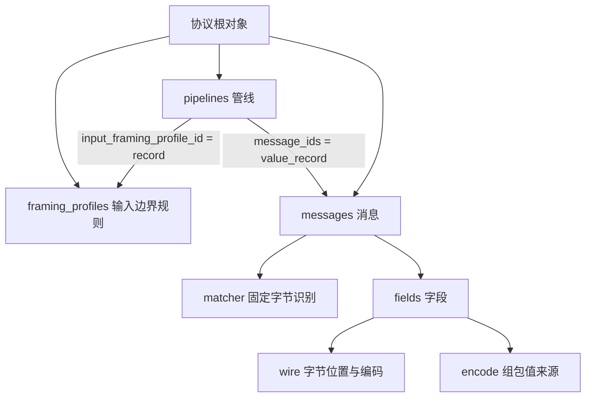

# 01 配置结构与二进制

打开同目录 [完整配置](01-最小二进制.pae.json)。目标：理解 `AA 01 02` 为什么解析为 `value=258`，并能自行改成另一条报文。

## 先建立结构关系

这张图表示配置引用，不表示每次执行必须经过 Framer。宿主已有完整记录时，可以直接使用公开 Codec。配置编译成功后形成冻结 Plan，不应每收一帧都重新加载 JSON。

## 根对象怎么填写

| 属性 | 本例含义与修改规则 |
| --- | --- |
| schema_version | 字符串 `0.9`，选择支持范围；不是产品版本，也不要写成数字0.9 |
| protocol_id | 协议稳定标识；不是显示名称 |
| protocol_version | 作者维护的协议版本字符串，与Schema版本分开 |
| display_name / description | 人类名称和解释；只在结构允许的位置填写，description最长1024字符 |
| source_ref | 规则来源标识；教学用SYNTHETIC，真实项目使用可追溯的规格条目标识，不放敏感路径 |
| resource_profile | 本例desktop；不是协议类型，不承诺进程内存硬上限 |
| framing_profiles | 输入边界定义；complete_record表示宿主已给出完整记录 |
| pipelines | 用ID引用输入规则和允许的消息，不能仅改被引用对象ID而遗漏引用 |
| messages | 消息布局、识别条件和字段定义 |

本例完整保留所需属性，初次修改不要删除它们。上述通用元数据中，根description可选；其他对象的必填项与版本分支应查随包Schema，不能把根对象的可选规则套到字段对象。

## 一条报文怎样对应字段

| 零基偏移 | 十六进制字节 | 解释 |
| --- | --- | --- |
| 0 | AA | matcher固定标识，不是value字段 |
| 1 | 01 | value高8位 |
| 2 | 02 | value低8位 |

- `frame_length_bytes=3`：总记录长度，包含固定标识。
- `matcher.all`：其中的条件都要满足；本例只列一个固定字节条件。
- `value_type=UINT64`：输出的逻辑类型，不表示线上占8字节。
- `wire.codec=unsigned_integer`：按无符号整数读写。
- `byte_offset=1`、`byte_width=2`：从第2个字节开始，占2字节。
- `byte_order=big_endian`：`01 02`表示258；若改为little_endian，同样字节表示513。
- `encode.source=input`：组包时宿主提供value；本例不需要输入固定AA。
- `direction_id=sample`：消息与所属管线方向一致；它不等于自动执行Decode或Encode。

## 在Lab中验证

1. 浏览加载本目录 `01-最小二进制.pae.json`。
2. 若提示未绑定，在“绑定设置”选择管线 `value_pipeline`、动作“解析”，应用绑定表，再回操作页。
3. 按Hex输入 `AA 01 02`，点击“解析完整记录”。预期value逻辑值258，物理范围偏移1、长度2。
4. 换为 `AA 00 07`，预期7。换为 `AB 00 07`，不应得到合法value结果。

SDK侧：编译这份配置，对 `value_pipeline` 调用完整记录Decode；Encode选择 `value_record` 并提供类型化UINT64字段value=258，预期 `AA 01 02`。这是API调用要求，不是现有示例程序的CLI参数说明。

练习：只改报文与只改byte_order分别观察结果；不要同时修改多个条件。若要增加第三个字段，需同步检查总长度、偏移、重叠和类型范围，不是只增加一个JSON对象。
