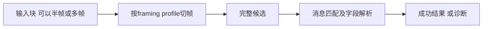

# 02 文本与流式

## 文本模板

加载 [最小文本完整配置](02-最小文本.pae.json)，使用 `text_pipeline`。Decode模板接受 `PING\r\n`，Encode模板生成 `PONG\r\n`，两者不是互为逆运算，也不会收到PING后自动发送PONG。

| 配置路径 | 作用 |
| --- | --- |
| layout.kind / encoding | text布局，线上只用ASCII |
| layout.decode.segments | 解析时按顺序匹配输入 |
| layout.encode.segments | 组包时按顺序生成输出 |
| kind=literal / text | 固定字面量，不需要调用方提供字段 |
| fields=[] | 合法的零动态字段消息，不表示解析失败 |

Lab操作：应用解析绑定后，先清空输入，再选择ASCII (escaped)，输入字符 `PING\r\n`，点击解析完整记录，预期匹配ping、0个字段。也可保持Hex输入 `50 49 4E 47 0D 0A`。不要在Hex模式先输入PING再切表示，旧内容不是合法Hex，会被拒绝转换。

组包绑定选择同一管线的Encode动作，无需输入动态字段，预期字节 `50 4F 4E 47 0D 0A`。需要动态文本时，再读体验包 `lab/configs/synthetic_ascii_text_slice.pae.json`：它的name、rx_code、tx_tag展示收发参与不同，不能假定所有字段同时参与两种动作。

## 完整记录与流式不是同一层

流式继续阅读体验包 `lab/configs/synthetic_stream_framing_slice.pae.json`（SDK的examples/config也提供该文件）：

| profile / pipeline | 配置规则 | 示例 |
| --- | --- | --- |
| fixed_three / fixed_rx | fixed_length，每3字节一个候选，无同步恢复 | AA 00 07，数值7 |
| sync_fixed_four / sync_fixed_rx | sync_fixed_length，A5 5A同步头，总长4 | 先找到同步头再收满记录 |
| sync_length_six / sync_length_rx | sync_length_field，C3 3C同步头，偏移2的1字节声明总长度，限制4到8字节 | 长度字段不是载荷长度 |

先只体验fixed_rx：应用解析绑定，流式输入分两次提交 `AA 00` 和 `07`，第一块不足一帧，第二块补齐后预期数值7。界面若保留待处理后缀，使用继续消费后缀；不要把“继续”当作提交新输入。

切帧只产生候选，不证明消息、校验或业务成功。ASCII CRLF流式另看 `synthetic_ascii_stream_slice.pae.json` 的0.11分支；不能只改schema_version就把完整记录例子变成流式协议。

## 下一层能力与排错

计算长度、校验及变长字段需要分别学习，不能把普通input字段命名为length就认为会自动回填。超出这两份最小配置时，结合随包 `schema/pae.schema.json` 与原有示例查对应版本规则。

配置失败先看诊断的stage、code、json_pointer与detail：语法错误先修JSON，引用错误检查ID，布局错误检查字节范围。运行失败再检查报文与配置是否一致。不要靠更换DLL或提高Schema版本掩盖错误。
