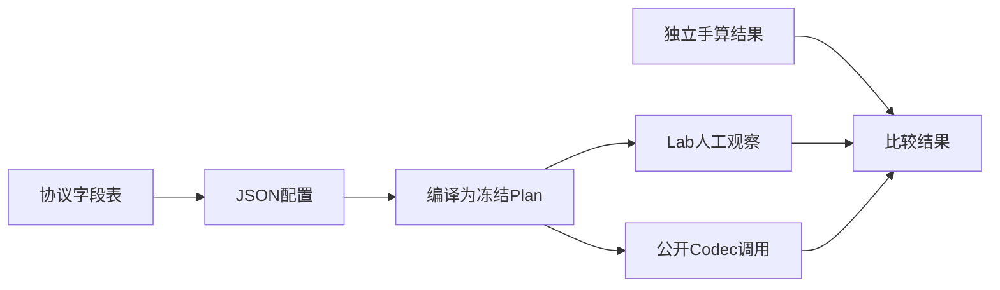

# 05 从协议表到SDK练习

目标是独立完成一次小协议接入，而不是读完全部源码。只用公开合成的3字节协议，不连接设备。先自己写，再对照 [参考配置](01-最小二进制.pae.json)。

## 第一步 把需求变成字段表

协议要求：每次输入已是一条完整记录，总长3字节，首字节AA，随后两个字节为大端无符号数值；支持解析及组包。没有校验、可变长度或自动应答。

| 偏移 | 长度 | 内容 | 来源 |
| --- | --- | --- | --- |
| 0 | 1字节 | AA | 固定识别规则 |
| 1 | 2字节 | value，0到65535 | 解析读取，组包由调用方提供 |

手算：`AA 01 02` → 1×256+2=258。反向把258分为高字节01、低字节02，再加固定AA。这是独立预期，不能拿程序输出反过来当标准答案。

## 第二步 编写并检查配置

把参考配置复制到自己的练习目录，保留原件。先解释三个引用：pipeline引用record、pipeline引用value_record、message方向与pipeline方向相同。再解释wire偏移1、宽度2、big_endian与总长度3的关系。

如果这些还不能说清楚，先看01和04，不必阅读内部Plan代码。完成后在Lab浏览你的副本，应用value_pipeline解析绑定，输入 `AA 01 02`，预期value=258。组包时在绑定设置增加或选择同管线的组包动作并应用，提供value=258，预期字节相同；固定AA不作为动态字段输入。

## 第三步 从Lab转到SDK

按03构建运行。源码的Decode先读取逻辑值，Encode独立提供258，再与手算字节比较；本例不是“把Decode结果未经检查直接发回去”。将来接设备时，通信缓冲、线程与业务决策由宿主负责。

## 第四步 故意犯错并恢复

每次只改一个条件，修复后再进行下一项。不要修改包内原件。

| 操作 | 失败发生在哪层 | 应检查什么 |
| --- | --- | --- |
| 报文换为AB 01 02 | 运行Decode | 首字节不匹配；不应显示旧成功字段 |
| 只输入AA 01 | 运行Decode | 完整记录缺少一个字节；本例不是等待后续块的流式模式 |
| 删除根protocol_id属性及相邻正确的逗号 | 配置编译 | MISSING_PROPERTY，定位protocol_id |
| 只把message_ids中的value_record改成missing_record | 配置编译 | UNKNOWN_REFERENCE，检查引用目标是否存在 |

后两种错误可直接按03的命令运行内存注入，查看pointer和detail；程序确认被正确拒绝才输出PASS。一般排错记录stage/code/pointer/detail，不仅保留一句“失败”。测试覆盖的是这两个具体编译错误，不承诺所有错误返回同一阶段或位置。

## 第五步 接口使用检查表

- 配置通常初始化时编译，变化后重新编译；不逐帧解释JSON。
- CompiledProtocol的metadata字符串为借用视图，销毁或替换owner后不能继续读；移动owner后重新查询。
- Codec结果也是借用视图，先读取或复制再继续调用；BYTES还依赖未修改的输入缓冲。不要把视图直接放进异步队列。
- 同一执行实例串行使用。流式回调数据仅在同步回调期间使用，跨回调保存时复制，不重入同一实例。
- Encode失败时不发送输出缓冲；不能把bytes_written=0理解为缓冲一定未改变。
- 本例固定索引0只适用于当前配置；多管线多消息通过公开metadata查找索引。

这些是接入提醒，不替代SDK公开头中的精确寿命与失效契约。仓库维护者下一步从 `include/pae/compiler.h`、`codec.h` 到 `src/public_api/compiler.cpp`、`codec.cpp` 追踪；仅拿到二进制SDK时先阅读公开头，不需要内部实现。

完成标准：你能不看答案说明字节布局，修改一个数值并预测结果，区分配置错误与报文错误，并知道结果何时必须复制。达到这里就可以开始自己的真实协议试用，不必先完成流式和所有高级特性。
