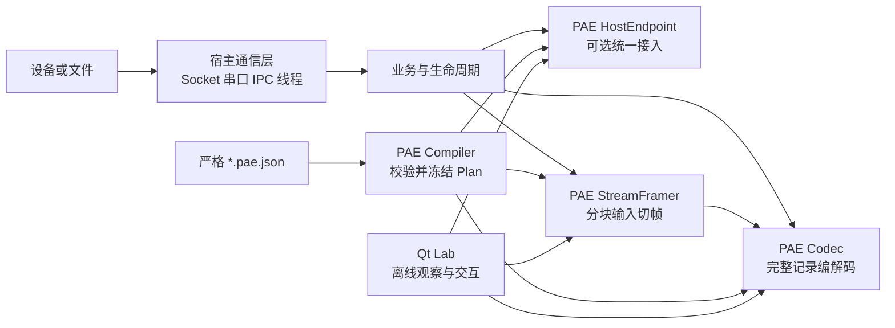

# 01 项目定位与能力边界

## 适用读者

- 第一次接触 PAE，需要先判断“它解决什么、不解决什么”的开发者；
- 准备把协议配置、编解码或切帧能力接入现有设备程序的 SDK 使用者；
- 需要区分 PAE Core、Host、Qt Lab 与真实通信层责任的维护者。

## 前置条件

阅读本页不要求构建项目。建议先确认你面对的是完整记录、分块字节流、还是尚未明确边界的真实通信数据；这会决定后续是否需要 `StreamFramer`。

## 读完能做什么

读完后应能选择“直接体验 Lab、消费 SDK、维护源码”三条路线之一，并避免把 UI 演示、自动测试或本地候选误写成正式发布和现场验收。

## 1. PAE 是什么

PAE（ProtocolAdapterEngine）把工业协议中可配置的结构和规则，与 Socket、串口、设备线程及业务状态机分开。当前公开能力围绕以下对象展开：

- `CompileProtocolJson()`：把严格 JSON 配置编译为只移动的 `CompiledProtocol`，内部拥有冻结 Plan；
- `CompleteRecordCodec`：对一条完整候选记录执行 Decode/Encode；
- `StreamFramer`：从有界分块输入中形成候选记录；
- `HostEndpoint`：为多个逻辑 endpoint/action/channel 提供绑定、Handle、回调和状态边界；
- Qt Lab：使用 PAE 公开能力进行离线观察和交互，不是第二套协议引擎。

下面的图表示职责依赖，不表示每次调用都必须依次经过所有方：

PAE 不打开 Socket、串口或 CAN，不创建设备线程，不拥有重试、自动转发、设备生命周期、业务路由或 UI。宿主可以直接组合 Codec/Framer，也可以用 HostEndpoint 统一绑定；两条路径不是上下级产品。

## 2. 当前能做什么

| 层次 | 当前事实 | 不能据此推出 |
| --- | --- | --- |
| 配置 | Schema 枚举 0.1～0.11；版本是增量能力切片 | 任意版本、任意协议都可配置 |
| Compiler | 严格输入、诊断、资源预算、冻结 `CompiledProtocol` | 配置正确就等于设备行为正确 |
| Codec | Binary/ASCII 支持域内的完整记录 Decode/Encode | 自动收包、粘包拆包或网络发送 |
| Framer | Binary 有界策略与 ASCII CRLF 有界流 | 候选形成就一定 Decode 成功 |
| Host | Decode/Push/Continue/Encode、Handle、同步 observer/business callback | Transport、异步队列或业务事务 |
| Qt Lab | Binary 完整 Decode/Encode、G2 流式观察及中文工作台；ASCII 0.10/0.11 路径 | 所有构建都启用相同公开路径；最新体验包已验证 installed-SDK |

完整 Schema 增量见 [Schema 索引](../../schema/README.md)。能力判断优先看当前公开头文件、配置查询结果和对应测试，不只看 Schema 版本号。

## 3. 所有权与借用边界

`CompiledProtocol`、Codec、Framer 和 Host 都有明确生命周期：

- `CompiledProtocol` 只移动；移动后应重新取得 description view；
- `ProtocolDescription` 等字符串视图借用编译所有者；
- Decode record/field view 借用 Codec 当前结果，下一次成功取得执行 guard 的 Decode/Encode、owner move 或析构都会使旧 view 失效；ASCII `BYTES` 还借用本次输入字节；
- Framer candidate、Host candidate、Decode 字段和 Encode bytes 只在当前同步 callback 内有效；跨调用保存时必须立即复制；
- `HostChannelHandle` 不拥有 Host；成功 `Reset()` 后旧 Handle 变 stale，需要重新 `Find()`。

这些约束以 [`include/README.md`](../../include/README.md) 和 `include/pae/*.h` 注释为准。

## 4. 三条使用路线

| 目标 | 从哪里开始 | 说明 |
| --- | --- | --- |
| 先看界面和公开合成配置 | [02 首次运行与 Lab 体验](02-首次运行与Lab体验.md) | 使用本机已归集 Release，不构建 |
| 在自己的 C++ 工程中接入 | [03 Windows SDK 集成](03-Windows-SDK集成.md) | Source/Static/Shared 三种包形态 |
| 修改 PAE 或 Lab 源码 | [05 架构与代码阅读](05-架构与代码阅读.md) | 从公开面追到实现与 UI 投影 |

要编写第一份协议配置，接着读 [04 协议配置入门](04-协议配置入门.md)；要构建、测试或排错，读 [06 构建测试与问题定位](06-构建测试与问题定位.md)。

## 5. 证据和发布边界

当前本机 SDK 候选来自 clean-checkpoint `98df5e0d844413fb6ad16a75dfceedcf17f2f1d6`，已有指定 Windows x64、MSVC v142 14.29.30133、Static/Shared Debug/Release 的限定验证。最新 Lab 功能体验另用 `fa81329/common-release` 仓库构建，身份和验证不能混用，见 [交付入口](../../deliverables/README.md)。SDK 仍然是本地候选：

- shared 构建仍有 C4251，不承诺稳定或跨 toolset C++ ABI；
- Linux preset 只保留早期 parser spike 路径，不是当前 SDK/Core/Lab 的 Linux 验证；
- 合成配置、自动测试、Lab 人工观察、Loopback、硬件、现场与生产验收是不同证据；
- 仓库尚未授予 PAE 项目级对外分发许可，Qt/yyjson 许可也不能替代 PAE 自身授权。

下一篇：[02 首次运行与 Lab 体验](02-首次运行与Lab体验.md)。
