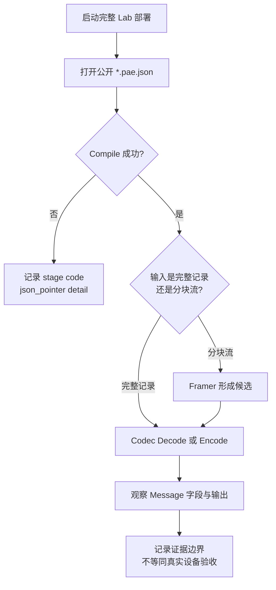

# 02 首次运行与 Lab 体验

## 适用读者

希望先运行已归集 Qt Lab、观察公开合成协议，再决定是否编写配置或接入 C++ 的开发者。

## 前置条件

- Windows x64；
- 本机仓库位于 `F:\PersonalWorkspace\协议解析拼接工具\protocol_adapter_engine`；
- `deliverables/lab/98df5e0` 已存在。该目录被 Git 忽略，仅 clone 仓库不会自动获得产物。

## 读完能做什么

读完后可以从正确的完整部署目录启动 Lab、选择合适的公开配置做一次离线观察，并知道哪些结果只是 UI 体验、哪些需要后续 SDK 或真实设备验证。

## 1. 启动已核验的 static Release

普通本地体验优先使用 static Release：

```powershell
$LabRoot = 'F:\PersonalWorkspace\协议解析拼接工具\protocol_adapter_engine\deliverables\lab\98df5e0\static-release'
& "$LabRoot\pae_protocol_lab_ui.exe"
```

完整目录至少包含 EXE、`Qt5Core.dll`、`Qt5Gui.dll`、`Qt5Widgets.dll`、`platforms/qwindows.dll` 和 `configs/*.pae.json`。不要只复制裸 EXE。shared 对照目录还必须保留同批 `pae.dll`。

如果启动失败，先确认：

```powershell
@(
  "$LabRoot\pae_protocol_lab_ui.exe",
  "$LabRoot\Qt5Core.dll",
  "$LabRoot\Qt5Gui.dll",
  "$LabRoot\Qt5Widgets.dll",
  "$LabRoot\platforms\qwindows.dll",
  "$LabRoot\configs"
) | ForEach-Object { [pscustomobject]@{ Path = $_; Exists = Test-Path -LiteralPath $_ } }
```

不要通过修改全局 `PATH` 去掩盖缺失模块；目录不完整时应回到原交付目录。

## 2. 选择第一份配置

建议先用小而明确的公开合成配置：

| 想观察什么 | 配置 | 当前 UI 边界 |
| --- | --- | --- |
| ASCII 完整记录 | `configs/synthetic_ascii_text_slice.pae.json` | Schema 0.10 Decode/Encode |
| ASCII CRLF 分块流 | `configs/synthetic_ascii_stream_slice.pae.json` | Schema 0.11 流式路径 |
| Binary 多类型字段 | `configs/synthetic_binary_ui_stage1.pae.json` | Schema 0.9 完整记录 Decode |

这些配置全部是从零构造的合成协议，不对应真实设备。`synthetic_ui_max.pae.json` 用于资源上界观察，不适合第一次阅读。

## 3. 一次有边界的 Lab 体验

第一次建议只做下面这一条 Binary 完整记录，不需要立即执行全部验收清单：

1. 点击 `Browse...`，选择完整路径 `F:\PersonalWorkspace\协议解析拼接工具\protocol_adapter_engine\deliverables\lab\98df5e0\static-release\configs\synthetic_binary_ui_stage1.pae.json`；如尚未加载，点击 `Load / Reload`。
2. 确认绑定草稿为 `device / Decode / ui_pipeline`，点击 `Apply binding table`。确认 `Active binding` 出现该绑定，选择 `Flow 0`，模式为 `Inspect`。
3. 在 `Raw input` 中粘贴下面的 Hex，然后点击 `Inspect complete record`：

```text
80 0D 03 00 01 00 CA FE 05 5A
```

4. 预期显示 `typed_record`、成功 9 个字段；其中 `count=1`、`payload=CAFE`、`marker=90`。选中 `payload` 行，底部 Hex 中的 `CA FE` 应高亮。这是一次观察，不是生产验收。
5. 完成后可以直接关闭程序；若询问是否丢弃本次状态，在不需要保留输入时确认即可。

以下是扩展到其他配置时的阅读要点，不是本次体验必须逐条完成的操作清单：

1. 从 Lab 打开上述配置之一；先看 Compile 结果和配置摘要，不要先接通信设备。
2. 对 ASCII 0.10 配置，使用配置中定义的完整记录格式观察 Decode，再填写 Encode 所需输入观察输出字节。
3. 对 ASCII 0.11 配置，区分“输入分块”“形成候选”和“候选 Decode 成功”三个事实。
4. 对 Binary 0.9 配置，只验证当前 UI 提供的完整记录 Decode；UI 没有 Binary Encode/stream 入口是当前产品边界，不等于非 Qt API 没有这些能力。
5. 需要保存字段、候选帧或输出字节时，在宿主代码的同步 callback 内复制；不要把 Lab 展示对象的寿命假设带入 SDK。



图中 Framer 只在 Pipeline 配置为流式输入时参与；完整记录路径不需要先过 Framer。

## 4. 先跑 SDK consumer（可选）

如果你准备写 C++，可先验证当前 Static Release 包的综合 consumer。必须在 Visual Studio Developer Shell 或已能调用相应 CMake/编译器的终端中执行，并使用新的包外构建目录：

```powershell
Set-Location 'F:\PersonalWorkspace\协议解析拼接工具\protocol_adapter_engine'
$PackageRoot = (Resolve-Path '.\deliverables\sdk\98df5e0\pae-sdk-static-release').Path
$BuildRoot = 'F:\PersonalWorkspace\pae-first-use-sdk-consumer'

cmake -S "$PackageRoot\examples\sdk_consumer" -B $BuildRoot `
  -G "Visual Studio 18 2026" -A x64 -T "v142,version=14.29.30133" `
  "-DCMAKE_PREFIX_PATH=$PackageRoot"
cmake --build $BuildRoot --config Release --target pae_sdk_stage3_consumer
& "$BuildRoot\Release\pae_sdk_stage3_consumer.exe" `
  "$PackageRoot\share\pae\examples\config\synthetic_stream_framing_slice.pae.json" `
  "$PackageRoot\share\pae\examples\config\synthetic_ascii_stream_slice.pae.json"
```

当前综合示例成功输出以 `PAE_SDK_STAGE3_CONSUMER_PASS` 开头。目录已存在时换新路径，不覆盖旧证据。此命令是既有候选的使用方式，本轮文档整理没有重新构建或运行它。

## 5. 不要从体验结果推出什么

- Lab 启动成功不等于 Compile/Decode/Encode 成功；
- 合成配置成功不等于真实协议资料已正确映射；
- Core 或 consumer 通过不等于 UI 生命周期、硬件或现场通过；
- 当前本机目录不是正式安装包或对外发布物。

下一篇：准备接入 C++ 时读 [03 Windows SDK 集成](03-Windows-SDK集成.md)；准备写配置时读 [04 协议配置入门](04-协议配置入门.md)。
