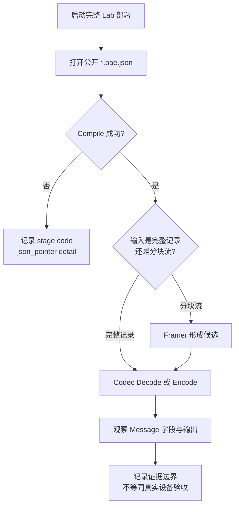

# 02 首次运行与 Lab 体验

## 适用读者

希望先运行 Qt Lab、观察公开合成协议，再决定是否编写配置或接入 C++ 的开发者。

## 前置条件

- Windows x64；
- 已在仓库根目录打开 PowerShell；
- 本机已有 `deliverables/lab/b12ad80/static-release/` 完整部署。产物被 Git 忽略，仅 clone 仓库不会自动获得；旧版入口另见下文附录。

## 读完能做什么

读完后可以从正确的完整部署目录启动 Lab、选择 JSON 或受限 YAML 合成配置做一次离线观察，并知道哪些结果只是 UI 体验、哪些需要后续 SDK 或真实设备验证。

## 1. 启动当前 Lab

首次使用选 `b12ad80` 的 **static Release**，同时支持 JSON 与受限 YAML 作者源。它使用同批带可选 `yaml_frontend` 的 SDK；shared Release 是另一部署形态。完整目录见 [统一交付入口](../../deliverables/README.md)。从仓库根目录启动：

```powershell
$LabRoot = (Resolve-Path 'deliverables/lab/b12ad80/static-release').Path
& "$LabRoot\pae_protocol_lab_ui.exe"
```

保留完整目录的 EXE、Qt DLL、`platforms/` 和 `configs/`，不要只复制 EXE。若 `Resolve-Path` 失败，说明本机没有该部署；按 [06 构建与排错](06-构建测试与问题定位.md) 及 [standalone 构建说明](../../tools/protocol_lab_ui/standalone/README.md) 选择生成路线。

## 2. 同一版本的两条正常解析

在“浏览”中选择配置，必要时点击“加载 / 重新加载”；在“绑定设置”应用对应草稿，再到“操作”输入 Hex 并点击“解析完整记录”。两项都使用 `$LabRoot\configs\` 下的合成文件：

| 作者源 | 配置与绑定 | Hex 输入 | 预期观察 |
| --- | --- | --- | --- |
| JSON | `synthetic_binary_ui_stage1.pae.json`；`device / Decode / ui_pipeline` | `80 0D 03 00 01 00 CA FE 05 5A` | `typed_record`，9 字段；`count=1`、`payload=CAFE`、`marker=90` |
| YAML | `synthetic_ascii_literal_only.pae.yaml`；`device / Decode / ascii_pipeline` | `50 49 4E 47 0D 0A` | `ping`，解析成功，0 字段 |

YAML 样例描述 `PING\r\n` 接收和 `PONG\r\n` 发送；本表只观察接收。JSON 直接进入编译器；YAML 先按 [受限 Profile V0.1](../../schema/pae_yaml_profile_v0.1.md) 转成严格 JSON，再进入同一编译器。`schema_version: "0.10"` 是协议 Schema 版本，不是 YAML 语言版本；两份作者源的完整对应样例见 [04 配置入门](04-协议配置入门.md)。

2026-09-26 用户已确认本版 static Release 的上述 JSON/YAML 正常解析通过，Lab 已关闭；输入与范围见 [人工记录](../engineering/yaml-clean-delivery-validation-20260926.md)。它只覆盖两条正常解析。配置错误诊断、shared 可见 UI、组包与真实协议未由此次人工操作验证。static/shared Debug/Release 的指定定向自动测试各 5/5，见 [Lab 验证](../engineering/yaml-clean-lab-validation-20260926.md)，不替代人工结果。

## 3. 失败时先看哪一层

YAML 文件先过可选前端：语法、受限标量、重复键或资源限制在这里失败时，没有可提交给编译器的 JSON。转换成功后再看 PAE 的 `CompileDiagnostic`：`stage`、`code`、`json_pointer` 和 `detail` 表示生成 JSON 的结构、引用或执行规则问题。显示的 YAML 行列可能是精确位置、最近祖先近似位置或“未提供”；生成 JSON 的 byte offset 不是原 YAML 偏移。JSON 文件直接从编译诊断开始。定位步骤见 [04 配置入门](04-协议配置入门.md)；不要把“加载失败”直接归因于 Codec。

## 附录：既有 JSON 候选与扩展观察

### 既有 JSON 功能体验入口

沿用此前 JSON 功能体验时，使用含结构化编译诊断的 installed-SDK static Release，包含 Binary G1/G2 及 ASCII/legacy 公开路径。SDK 身份为 clean 7b4205e；Lab 为 fe1683c 加诊断和打包修补，并非干净提交重建。此入口身份与上方 YAML 新候选分开，完整证据见 [统一交付入口](../../deliverables/README.md)。

```powershell
$RepoRoot = (Get-Location).Path
$LabRoot = (Resolve-Path 'deliverables/lab/fe1683c-plus-patches/static-release').Path
& "$LabRoot\pae_protocol_lab_ui.exe"
```

若 `Resolve-Path` 失败，说明本机尚未归集此既有候选；clone 不包含 SDK/Lab 二进制。先按 [06 构建测试与问题定位](06-构建测试与问题定位.md) 选择 standalone Lab 路线，并从 [`tools/protocol_lab_ui/standalone/README.md`](../../tools/protocol_lab_ui/standalone/README.md) 生成完整部署，不要猜测旧 trial 路径。

完整目录至少包含 EXE、`Qt5Core.dll`、`Qt5Gui.dll`、`Qt5Widgets.dll`、`platforms/qwindows.dll` 和 `configs/*.pae.json`。不要只复制裸 EXE。shared 对照目录还必须保留同批 `pae.dll`。

如果启动失败，先确认：

```powershell
@(
  "$LabRoot\pae_protocol_lab_ui.exe",
  "$LabRoot\Qt5Core.dll",
  "$LabRoot\Qt5Gui.dll",
  "$LabRoot\Qt5Widgets.dll",
  "$LabRoot\platforms\qwindows.dll",
  "$LabRoot\configs"
) | ForEach-Object { [pscustomobject]@{ Path = $_; Exists = Test-Path -LiteralPath $_ } }
```

不要通过修改全局 `PATH` 去掩盖缺失模块；目录不完整时应回到原交付目录。

### 既有 JSON 配置选择

建议先用小而明确的公开合成配置：

| 想观察什么 | 配置 | 当前 UI 边界 |
| --- | --- | --- |
| ASCII 完整记录 | `configs/synthetic_ascii_text_slice.pae.json` | Schema 0.10 Decode/Encode |
| ASCII CRLF 分块流 | `configs/synthetic_ascii_stream_slice.pae.json` | Schema 0.11 流式路径 |
| Binary 多类型字段 | `configs/synthetic_binary_ui_stage1.pae.json` | Schema 0.9 完整记录 Decode |
| Binary 分块流 | `configs/synthetic_stream_framing_slice.pae.json` | G2 Submit/Continue/Reset，继续可用时输入框只读 |

这些配置全部是从零构造的合成协议，不对应真实设备。`synthetic_ui_max.pae.json` 用于资源上界观察，不适合第一次阅读。

Binary 分块流示例位于 `$LabRoot\configs\synthetic_stream_framing_slice.pae.json`。该文件已按限定修补补入部署，不需要回读开发仓库。

### 既有 Binary 完整记录观察

若选择本节的既有 JSON 路线，第一次建议只做下面这一条 Binary 完整记录，不需要立即执行全部验收清单：

1. 点击“浏览”，选择 `$LabRoot\configs\synthetic_binary_ui_stage1.pae.json`；如尚未加载，点击“加载 / 重新加载”。
2. 在“绑定设置”中确认草稿为 `device / 解析 / ui_pipeline`，点击“应用绑定表”。返回“操作”，确认当前绑定，选择 `Flow 0`，当前动作为“解析”。
3. 在“原始输入”中粘贴下面的 Hex，然后点击“解析完整记录”：

```text
80 0D 03 00 01 00 CA FE 05 5A
```

4. 预期显示 `typed_record`、成功 9 个字段；其中 `count=1`、`payload=CAFE`、`marker=90`。选中 `payload` 行，在右下“报文字节”页查看 `CA FE` 高亮。这是一次观察，不是生产验收。
5. 完成后可以直接关闭程序；若询问是否丢弃本次状态，在不需要保留输入时确认即可。

以下是扩展到其他配置时的阅读要点，不是本次体验必须逐条完成的操作清单：

1. 从 Lab 打开上述配置之一；先看 Compile 结果和配置摘要，不要先接通信设备。
2. 对 ASCII 0.10 配置，使用配置中定义的完整记录格式观察 Decode，再填写 Encode 所需输入观察输出字节。
3. 对 ASCII 0.11 配置，区分“输入分块”“形成候选”和“候选 Decode 成功”三个事实。
4. Binary 完整组包需选择支持 Encode 的配置及绑定；流式请用上表 framing 配置。输入块形成候选后，“继续”只消费已冻结后缀/内部状态，不读取新编辑草稿；可继续时编辑框只读。首次体验无需重跑专项验收。
5. 需要保存字段、候选帧或输出字节时，在宿主代码的同步 callback 内复制；不要把 Lab 展示对象的寿命假设带入 SDK。


```mermaid
flowchart TD
    Start["启动完整 Lab 部署"] --> Open["打开公开 *.pae.json"]
    Open --> Compile{"Compile 成功?"}
    Compile -- "否" --> Diagnostic["记录 stage code<br/>json_pointer detail"]
    Compile -- "是" --> Input{"输入是完整记录<br/>还是分块流?"}
    Input -- "完整记录" --> Codec["Codec Decode 或 Encode"]
    Input -- "分块流" --> Framer["Framer 形成候选"]
    Framer --> Codec
    Codec --> Observe["观察 Message 字段与输出"]
    Observe --> Boundary["记录证据边界<br/>不等同真实设备验收"]
```

图中 Framer 只在 Pipeline 配置为流式输入时参与；完整记录路径不需要先过 Framer。

### 既有 SDK consumer（可选）

如果你准备写 C++，下列命令仍可复核既有 `7b4205e` Static Release 包的综合 consumer；当前 `b12ad80` SDK 的包外验证另见 [同基线 SDK 验证](../engineering/yaml-clean-sdk-validation-20260926.md)。必须在 Visual Studio Developer Shell 或已能调用相应 CMake/编译器的终端中执行，并使用新的包外构建目录：

```powershell
$RepoRoot = (Get-Location).Path
$PackageRoot = (Resolve-Path 'deliverables/sdk/7b4205e/pae-sdk-static-release').Path
$BuildRoot = Join-Path $RepoRoot 'out/build/first-use-sdk-consumer'
if (Test-Path -LiteralPath $BuildRoot) {
  throw "Choose a fresh build directory: $BuildRoot"
}

cmake -S "$PackageRoot\examples\sdk_consumer" -B $BuildRoot `
  -G "Visual Studio 18 2026" -A x64 -T "v142,version=14.29.30133" `
  "-DCMAKE_PREFIX_PATH=$PackageRoot"
cmake --build $BuildRoot --config Release --target pae_sdk_stage3_consumer
& "$BuildRoot\Release\pae_sdk_stage3_consumer.exe" `
  "$PackageRoot\share\pae\examples\config\synthetic_stream_framing_slice.pae.json" `
  "$PackageRoot\share\pae\examples\config\synthetic_ascii_stream_slice.pae.json"
```

当前综合示例成功输出以 `PAE_SDK_STAGE3_CONSUMER_PASS` 开头。目录已存在时换新路径，不覆盖旧证据。此命令是既有候选的使用方式，本轮文档整理没有重新构建或运行它。

### 不要从体验结果推出什么

- Lab 启动成功不等于 Compile/Decode/Encode 成功；
- 合成配置成功不等于真实协议资料已正确映射；
- Core 或 consumer 通过不等于 UI 生命周期、硬件或现场通过；
- 当前本机目录不是正式安装包或对外发布物。

下一篇：准备接入 C++ 时读 [03 Windows SDK 集成](03-Windows-SDK集成.md)；准备写配置时读 [04 协议配置入门](04-协议配置入门.md)。
