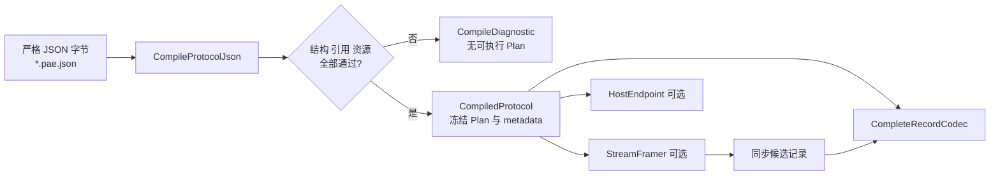

# 04 协议配置入门

## 适用读者

准备从设备规格书编写第一份 `*.pae.json`，或需要理解配置怎样成为冻结 Plan 的开发者。

## 前置条件

- 已取得可引用的协议规格、字段表或内部需求标识；
- 已判断输入是完整记录还是分块字节流；
- 不把仓库合成配置当作真实协议权威。

## 读完能做什么

读完后可以选择接近的合成样例，建立一份最小私有配置，理解根对象、Pipeline、Message、Field 与引用关系，并用编译诊断逐步收敛问题。

## 1. 配置如何进入执行层



Compiler 成功后，执行热路径读取冻结状态，不应逐帧重新解释 JSON。Codec、Framer、Host 是对同一编译事实的不同消费方式，不是所有请求都必须串行经过三者。

## 2. 先选接近的样例

| 真实输入特征 | 起步样例 | 主要 Schema |
| --- | --- | --- |
| 宿主已提供完整 ASCII 记录 | `examples/config/synthetic_ascii_text_slice.pae.json` | 0.10 |
| CRLF 结束的 ASCII 分块流 | `examples/config/synthetic_ascii_stream_slice.pae.json` | 0.11 |
| 固定/同步 Binary 流 | `examples/config/synthetic_stream_framing_slice.pae.json` | 0.9 |
| computed length | `examples/config/synthetic_length_slice.pae.json` | 0.7 |
| 有界变长 Binary 记录 | `examples/config/synthetic_bounded_variable_record.pae.json` | 0.8 |

协议未明确时不要默认选 ASCII。Schema 版本是增量能力切片，不表示“高版本包含任意协议功能”；先读 [Schema 索引](../../schema/README.md)。

## 3. 四级学习路线

四级表示学习顺序，不是 Schema 版本。每一级都继续复用 `examples/config/` 中从零设计的公开配置；
只有第一级的最小程序在本轮实际执行，后三级是下一步可复用的现有入口和独立预期，不能据此宣称
本轮已经运行。

### 第一级：固定 Binary 完整记录

- 配置：[`synthetic_stream_framing_slice.pae.json`](../../examples/config/synthetic_stream_framing_slice.pae.json)
- 操作：运行 [`examples/getting_started`](../../examples/getting_started/README.md)，只走公开
  Compiler/Codec API 的 `fixed_rx` Pipeline。
- 输入：`AA 00 07`。
- 对应配置：`AA` 来自 `fixed_message.matcher.fixed_bytes`；`00 07` 是
  `fixed_payload` 的双字节大端 `UINT64`。
- 预期：Decode 得到 `fixed_payload=7`；Encode 输入类型化 `UINT64 7` 得到 `AA 00 07`。
- 小练习：当前程序没有“输入一个数值”的 CLI 参数；在
  `examples/getting_started/main.cpp` 中找到 `kExpectedFrame`，把其三个手写字节从
  `{0xAAU, 0x00U, 0x07U}` 改为 `{0xAAU, 0x01U, 0x02U}`。Decode 会得到 258，随后 Encode
  使用该 Decode 值，并由末尾的 `encoded_frame != kExpectedFrame` 断言 `AA 01 02`。这是源码练习，
  不是运行时传参；不要从程序实际输出反推预期。

这一级先理解“配置编译为冻结 Plan、Pipeline 限定 Message、字段映射到字节”。虽然配置还包含流式
framing profiles，最小程序直接向 `CompleteRecordCodec` 提交一条完整的三字节记录。

### 第二级：ASCII 完整记录

- 配置：[`synthetic_ascii_text_slice.pae.json`](../../examples/config/synthetic_ascii_text_slice.pae.json)
- 操作：阅读并运行既有 [`public_api_codec`](../../examples/public_api_codec/README.md) 的 ASCII 路径。
  该程序只接收 Binary/ASCII 两个配置路径，成功时只输出 `PUBLIC_CODEC_EXAMPLE gate=PASS`；它不接收
  任意报文或字段值参数。其 `RunAscii()` 当前硬编码 `name=ALICE`、`tx_tag=Z`，并断言
  `TX ALICE!Z\r\n`。
- 映射阅读向量：文本 `RX A!OK\r\n`，十六进制为 `52 58 20 41 21 4F 4B 0D 0A`；这是用来对照
  配置的独立 Decode 向量，不是当前 `public_api_codec` 的直接运行输入。
- 对应配置：literal `RX `、`!`、CRLF 固定边界；`name=A`，`rx_code=OK`。
- 当前示例 Encode：`name=ALICE`、`tx_tag=Z`；预期文本 `TX ALICE!Z\r\n`，十六进制为
  `54 58 20 41 4C 49 43 45 21 5A 0D 0A`。
- 小练习：修改 `examples/public_api_codec/main.cpp` 的 `name` 常量及相邻 `expected` 常量为 `BOB`
  和 `TX BOB!Z\r\n`；保持 `tx_tag=Z`。这是源码修改，不是追加 CLI 参数；同时观察 `name` 的
  `max_byte_length=8`，不要引入越界字符串。

这一级比较 Decode 与 Encode 使用不同模板的事实，不能从 Pipeline 名称、方向字符串或一次成功推断
另一动作可用；应查询 `PipelineMessageExecution()` 和 ASCII metadata。

### 第三级：computed length 与 SUM8

- 长度配置：[`synthetic_length_slice.pae.json`](../../examples/config/synthetic_length_slice.pae.json)
- 长度输入：`AA 00 06 07 2A 55`。`record_length` 位于偏移 1、双字节大端且由引擎计算为 6；
  `value=7`，`payload=2A`，头尾固定字节分别为 `AA`、`55`。
- 长度预期：Decode 接受长度 6；Encode 只提供动态 `value` 和 `payload`，不得再把 computed 字段
  当作 caller input。
- 校验配置：[`synthetic_sum8_slice.pae.json`](../../examples/config/synthetic_sum8_slice.pae.json)
- 校验输入：`70 01 02 03 04 0A 7E`。SUM8 覆盖偏移 1 起的四字节
  `01+02+03+04=0A (mod 256)`，存储在偏移 5；`70`、`7E` 是范围外 Matcher 字节。
- 校验预期：合法帧 Decode 成功；单独把校验字节改为 `0B` 应返回完整性失败，而不是未知消息。
- 操作：用 [`public_api_codec`](../../examples/public_api_codec/README.md) 的相同公开 Codec 调用形状分别
  加载两份配置；本轮未新增这两份配置的教学可执行程序。
- 小练习：把 SUM8 帧的 `payload_a` 从 `01` 改为 `05`，预期校验字节同步从 `0A` 改为 `0E`；再保留
  旧校验字节观察失败。SUM8 只检测有限意外损坏，不是认证或防篡改机制。

这一级区分业务字段、computed 字段、完整性存储和 Matcher。校验成功不替代结构匹配，Bundle Hash
也不替代协议完整性规则。

### 第四级：分块流式输入

- 配置：继续使用
  [`synthetic_stream_framing_slice.pae.json`](../../examples/config/synthetic_stream_framing_slice.pae.json)
  的 `fixed_three/fixed_rx`。
- 操作：运行既有 [`public_api_framer`](../../examples/public_api_framer/README.md)，先查询 framing
  capability，再为一个逻辑流创建 `StreamFramer`。现有程序一次 Push 固定数组
  `AA 00 01 AA 00 02`，成功输出 `PUBLIC_FRAMER_CONSUMER_PASS candidates=2 decode_calls=2`；它不接收
  任意分块字节 CLI 参数。
- 分块学习向量：第一次 Push `AA 00`；第二次 Push `07 AA 00 08`。这是修改示例源码后要验证的
  独立向量，不是现有程序的直接运行行为。
- 对应配置：`fixed_three.frame_length_bytes=3`；候选 Message 的首字节 Matcher 为 `AA`，后两字节
  分别 Decode 为 `fixed_payload=7` 和 `fixed_payload=8`。
- 预期：把 `examples/public_api_framer/main.cpp` 的单次 `input_bytes`/`Push` 改为上述两次 Push 后，
  第一次没有完整候选；第二次同步交付 `AA 00 07`、`AA 00 08` 两个候选，每个候选最多调用一次
  Decode。必须同步更新原示例对 payload 1/2 的断言。
- 小练习：在完成这项源码修改后，只改变分块边界，例如依次 Push `AA`、`00 07 AA`、`00 08`，
  候选字节和顺序应不变；这仍需重新编译运行，不能只改文档预期。

Framer callback 的候选视图只在同步回调内有效；需要跨回调保存时必须复制。候选形成不等于 Decode
成功，`bytes_consumed` 之后的后缀仍由调用者管理，PAE 不隐式持有 Transport、线程、重试或设备生命周期。

本轮第一级的实际命令、输出和边界记录在
[`examples/getting_started/验证记录.md`](../../examples/getting_started/验证记录.md)。

## 4. 建立私有工作副本

真实设备资料默认放在被 Git 忽略的 `local_private/`，不要直接改公开合成样例：

```powershell
$RepoRoot = (Get-Location).Path
$PrivateConfig = '.\local_private\my-device\my-device.pae.json'
if (Test-Path -LiteralPath $PrivateConfig) {
  throw "Refusing to overwrite existing private configuration: $PrivateConfig"
}
New-Item -ItemType Directory -Force (Split-Path -Parent $PrivateConfig) | Out-Null
Copy-Item '.\examples\config\synthetic_ascii_text_slice.pae.json' $PrivateConfig
```

这只是建立工作副本，不表示所选样例适合你的协议。

## 5. 最小根对象和引用关系

权威结构在 [`schema/pae.schema.json`](../../schema/pae.schema.json)。根对象至少包含：

```text
schema_version
protocol_id / protocol_version
display_name / source_ref
resource_profile
framing_profiles[]
pipelines[]
messages[]
```

建议按以下顺序修改：

1. 改 `protocol_id`、`protocol_version`、`display_name`、`source_ref`；
2. 定义 `framing_profiles`：完整记录用 `complete_record`，只有明确的流式规则才选相应 stream strategy；
3. 定义有方向的 Pipeline，并让 `input_framing_profile_id`、`message_ids` 指向真实 ID；
4. 定义 Message matcher 或 ASCII layout；
5. 定义 Field 的逻辑类型、wire、边界和 `encode.source`；
6. 最后增加 length/integrity/conversion 等规则，并逐项核对所选 Schema 的支持域。

Stable ID 当前匹配 `^[a-z][a-z0-9_]*$`。`direction_id` 是协议绝对方向，不建议用观察方相关的临时 `rx/tx` 含义替代规格书方向。文件名不参与协议身份。

## 6. `source_ref` 和真实资料

合成样例使用 `SYNTHETIC_FROM_SCRATCH:*`，真实配置必须替换为可追溯的规格书章节、需求编号或内部引用。将规格中的每条字节规则映射到配置，不要从合成输出反推真实协议。

仓库不应纳入客户名称、线路名称、真实报文或内部业务秘密。需要抽取公开测试时，应重新构造不对应真实设备的合成协议。

## 7. 编译失败怎样看

`CompileDiagnostic` 提供：

- `stage`：失败阶段；
- `code`：稳定错误分类；
- `json_pointer` 与可选 `byte_offset`：输入位置；
- `detail`：补充说明；
- 资源问题还会给出 `required_bytes`、`limit_bytes` 和 profile。

按“JSON 词法 → 结构 → 引用/领域规则 → 资源预算”从前到后修复，不在一次改动中同时重写大量 ID 和布局。根对象与子对象默认拒绝未知属性；重复 key、Number token 和 Unicode 约束还受 [`strict_json_profile_v0.1.md`](../../schema/strict_json_profile_v0.1.md) 约束。

## 8. 从 Lab 到真实宿主

1. 先在 Lab 用已知完整输入核对 Compile、Message 命中、字段和 Encode 字节；
2. 再用公开 SDK consumer 或自己的最小程序查询 metadata 并执行；
3. 最后才接通信层，分别记录 Transport、Framing、Decode 和业务交付结果；
4. 真实协议、硬件和现场验收另建证据，不用合成样例成功替代。

下一篇：维护实现读 [05 架构与代码阅读](05-架构与代码阅读.md)；遇到编译、链接或运行问题读 [06 构建测试与问题定位](06-构建测试与问题定位.md)。
