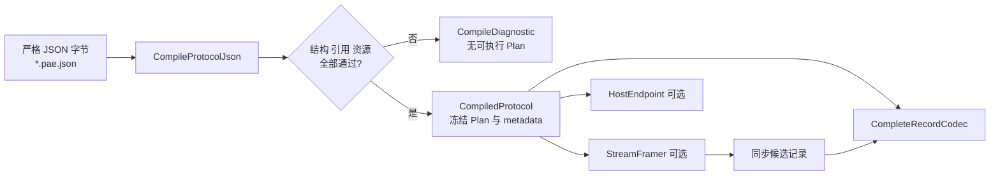

# 04 协议配置入门

## 适用读者

准备从设备规格书编写第一份 `*.pae.json`，或需要理解配置怎样成为冻结 Plan 的开发者。

## 前置条件

- 已取得可引用的协议规格、字段表或内部需求标识；
- 已判断输入是完整记录还是分块字节流；
- 不把仓库合成配置当作真实协议权威。

## 读完能做什么

读完后可以选择接近的合成样例，建立一份最小私有配置，理解根对象、Pipeline、Message、Field 与引用关系，并用编译诊断逐步收敛问题。

## 1. 配置如何进入执行层



Compiler 成功后，执行热路径读取冻结状态，不应逐帧重新解释 JSON。Codec、Framer、Host 是对同一编译事实的不同消费方式，不是所有请求都必须串行经过三者。

## 2. 先选接近的样例

| 真实输入特征 | 起步样例 | 主要 Schema |
| --- | --- | --- |
| 宿主已提供完整 ASCII 记录 | `examples/config/synthetic_ascii_text_slice.pae.json` | 0.10 |
| CRLF 结束的 ASCII 分块流 | `examples/config/synthetic_ascii_stream_slice.pae.json` | 0.11 |
| 固定/同步 Binary 流 | `examples/config/synthetic_stream_framing_slice.pae.json` | 0.9 |
| computed length | `examples/config/synthetic_length_slice.pae.json` | 0.7 |
| 有界变长 Binary 记录 | `examples/config/synthetic_bounded_variable_record.pae.json` | 0.8 |

协议未明确时不要默认选 ASCII。Schema 版本是增量能力切片，不表示“高版本包含任意协议功能”；先读 [Schema 索引](../../schema/README.md)。

## 3. 建立私有工作副本

真实设备资料默认放在被 Git 忽略的 `local_private/`，不要直接改公开合成样例：

```powershell
Set-Location 'F:\PersonalWorkspace\协议解析拼接工具\protocol_adapter_engine'
$PrivateConfig = '.\local_private\my-device\my-device.pae.json'
if (Test-Path -LiteralPath $PrivateConfig) {
  throw "Refusing to overwrite existing private configuration: $PrivateConfig"
}
New-Item -ItemType Directory -Force (Split-Path -Parent $PrivateConfig) | Out-Null
Copy-Item '.\examples\config\synthetic_ascii_text_slice.pae.json' $PrivateConfig
```

这只是建立工作副本，不表示所选样例适合你的协议。

## 4. 最小根对象和引用关系

权威结构在 [`schema/pae.schema.json`](../../schema/pae.schema.json)。根对象至少包含：

```text
schema_version
protocol_id / protocol_version
display_name / source_ref
resource_profile
framing_profiles[]
pipelines[]
messages[]
```

建议按以下顺序修改：

1. 改 `protocol_id`、`protocol_version`、`display_name`、`source_ref`；
2. 定义 `framing_profiles`：完整记录用 `complete_record`，只有明确的流式规则才选相应 stream strategy；
3. 定义有方向的 Pipeline，并让 `input_framing_profile_id`、`message_ids` 指向真实 ID；
4. 定义 Message matcher 或 ASCII layout；
5. 定义 Field 的逻辑类型、wire、边界和 `encode.source`；
6. 最后增加 length/integrity/conversion 等规则，并逐项核对所选 Schema 的支持域。

Stable ID 当前匹配 `^[a-z][a-z0-9_]*$`。`direction_id` 是协议绝对方向，不建议用观察方相关的临时 `rx/tx` 含义替代规格书方向。文件名不参与协议身份。

## 5. `source_ref` 和真实资料

合成样例使用 `SYNTHETIC_FROM_SCRATCH:*`，真实配置必须替换为可追溯的规格书章节、需求编号或内部引用。将规格中的每条字节规则映射到配置，不要从合成输出反推真实协议。

仓库不应纳入客户名称、线路名称、真实报文或内部业务秘密。需要抽取公开测试时，应重新构造不对应真实设备的合成协议。

## 6. 编译失败怎样看

`CompileDiagnostic` 提供：

- `stage`：失败阶段；
- `code`：稳定错误分类；
- `json_pointer` 与可选 `byte_offset`：输入位置；
- `detail`：补充说明；
- 资源问题还会给出 `required_bytes`、`limit_bytes` 和 profile。

按“JSON 词法 → 结构 → 引用/领域规则 → 资源预算”从前到后修复，不在一次改动中同时重写大量 ID 和布局。根对象与子对象默认拒绝未知属性；重复 key、Number token 和 Unicode 约束还受 [`strict_json_profile_v0.1.md`](../../schema/strict_json_profile_v0.1.md) 约束。

## 7. 从 Lab 到真实宿主

1. 先在 Lab 用已知完整输入核对 Compile、Message 命中、字段和 Encode 字节；
2. 再用公开 SDK consumer 或自己的最小程序查询 metadata 并执行；
3. 最后才接通信层，分别记录 Transport、Framing、Decode 和业务交付结果；
4. 真实协议、硬件和现场验收另建证据，不用合成样例成功替代。

下一篇：维护实现读 [05 架构与代码阅读](05-架构与代码阅读.md)；遇到编译、链接或运行问题读 [06 构建测试与问题定位](06-构建测试与问题定位.md)。
