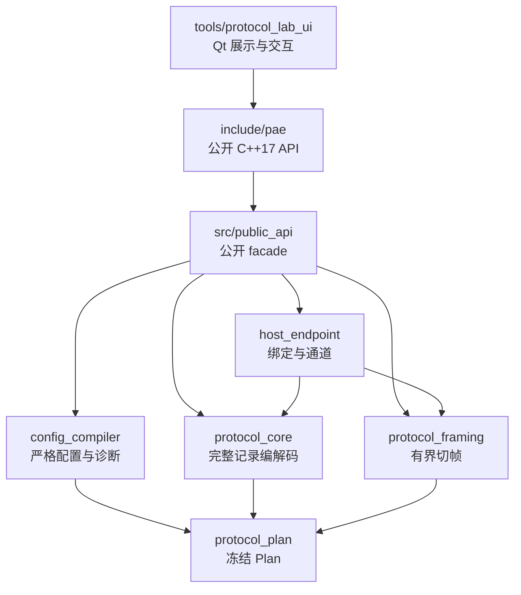

# 05 架构与代码阅读

## 适用读者

需要修改 PAE 公开 API、Compiler/Plan/Core/Framer/Host，或追踪 Qt Lab 如何消费这些能力的维护者。

## 前置条件

- 已读 [01 项目定位与能力边界](01-项目定位与能力边界.md)；
- 明确当前任务是理解代码、修改某层实现，还是核对历史证据；
- 先读取适用 `AGENTS.md` 和实时 Git 状态，不从历史“下一步”推导当前授权。

## 读完能做什么

读完后可以从公开 API 找到实现落点、示例、Schema 与 Lab 投影，并针对一个小调用回路选择最少文件，而不是通读全部历史报告。

## 1. 权威性顺序

当前用户授权和 `AGENTS.md` → 当前源码/CMake → Schema 与公开头注释 → 对应专项契约/验证 → 历史归档。

验证报告证明的是当时列明的输入、配置和平台；源代码已变化时，应重新核对，不能让旧报告覆盖当前事实。

## 2. 架构地图



箭头表示代码依赖方向。Qt Lab 依赖公开层；PAE Core 不依赖 Qt。Compiler 负责把配置变成冻结执行事实，Core 不应在热路径重新解释 JSON。

## 3. 五站阅读法

1. **公开面**：先读 [`include/README.md`](../../include/README.md)，再按问题打开 `compiler.h`、`protocol_description.h`、`codec.h`、`stream_framer.h`、`host_endpoint.h`。
2. **公开实现**：对应读 `src/public_api/{compiler,codec,stream_framer,host_endpoint}.cpp`；`compiled_state_internal.h` 是共享冻结状态边界，不是 consumer 头。
3. **可运行示例**：综合路线看 `examples/public_api_sdk_consumer/`；小回路看 `public_api_compile`、`public_api_codec`、`public_api_framer`、`public_api_host`。
4. **配置契约**：从 [`schema/README.md`](../../schema/README.md) 选版本，再查 Schema、执行语义和 strict JSON profile。
5. **Lab 投影**：最后读 `tools/protocol_lab_*`，确认 UI 只映射/展示公开事实。

## 4. 按问题选最小文件集

| 问题 | 先读 | 实现/示例 |
| --- | --- | --- |
| 配置为何失败 | `include/pae/compiler.h` | `src/public_api/compiler.cpp`、`schema/*` |
| Pipeline/Message/Field metadata | `compiler.h`、`protocol_description.h` | 综合 SDK consumer |
| 完整记录编解码 | `include/pae/codec.h` | `src/public_api/codec.cpp`、`examples/public_api_codec/` |
| 分块输入如何切帧 | `include/pae/stream_framer.h` | `src/public_api/stream_framer.cpp`、`examples/public_api_framer/` |
| 多逻辑通道怎样绑定 | `include/pae/host_endpoint.h` | `src/public_api/host_endpoint.cpp`、`examples/public_api_host/` |
| SDK target 从哪里来 | `src/public_api/CMakeLists.txt` | 包内 `lib/cmake/PAE/` 与 consumer CMake |
| ASCII Lab 接线 | `tools/protocol_lab_ascii/public_ascii_*` | `ascii_host_adapter.cpp`、`document_session.cpp` |
| Binary UI 边界 | `tools/protocol_lab_binary/public_binary_decode.*` | `binary_host_adapter_public.*`、`schema_dispatch.cpp` |
| installed SDK Lab | `tools/protocol_lab_ui/standalone/CMakeLists.txt` | 输入准备与 Deploy CMake |

## 5. 一条小调用回路

以完整记录 Decode 为例：

```text
CompileProtocolJson
  -> CompiledProtocol::Pipeline()/Message()/Field()
  -> CreateCompleteRecordCodec
  -> CompleteRecordCodec::Decode
  -> DecodeResult / borrowed DecodedRecordView
```

阅读时先确认 index 来自公开查询还是调用者约定，再看错误状态与 view 寿命。不要先跳到 Qt model，也不要从私有 `PlanBundle` 反推 consumer 用法。

流式路径只在前面增加 `CreateStreamFramer` 与 `Push/Continue`；每个同步候选可以交给 Codec。候选形成、Codec 尝试、Decode 成功和业务 callback 返回是四个不同事实。

## 6. Lab 的特殊边界

Lab 典型阅读顺序：

```text
main.cpp / ApplicationWindow
  -> DocumentTab / DocumentSession
  -> SchemaDispatch（只分类顶层 schema_version）
  -> public ASCII/Binary adapter
  -> PAE public Compiler / Codec / Framer / Host
```

`schema_dispatch.cpp` 不应变成第二个协议编译器。`description_mapping.*`、`owned_presentation_types.h` 和 Qt model/delegate 只处理展示所有权与格式化，不改变执行语义。当前 ASCII 0.10/0.11 已接入；Binary UI 只开放 0.9 完整记录 Decode。

## 7. 修改前的停点

- 公共头、根 CMake、Schema 和 Qt UI 是不同变更面；先缩小范围；
- shared ABI、borrowed view、同步 callback、Reset/Handle generation 都是高风险边界；
- 构建通过、CTest、人工 UI、SDK 包外消费、硬件和现场验收分别记录；
- 需要精确契约时进入 [工程依据索引](../engineering/README.md)，不要把整个 `docs/engineering` 当成顺序教程。

下一篇：[06 构建测试与问题定位](06-构建测试与问题定位.md)。
