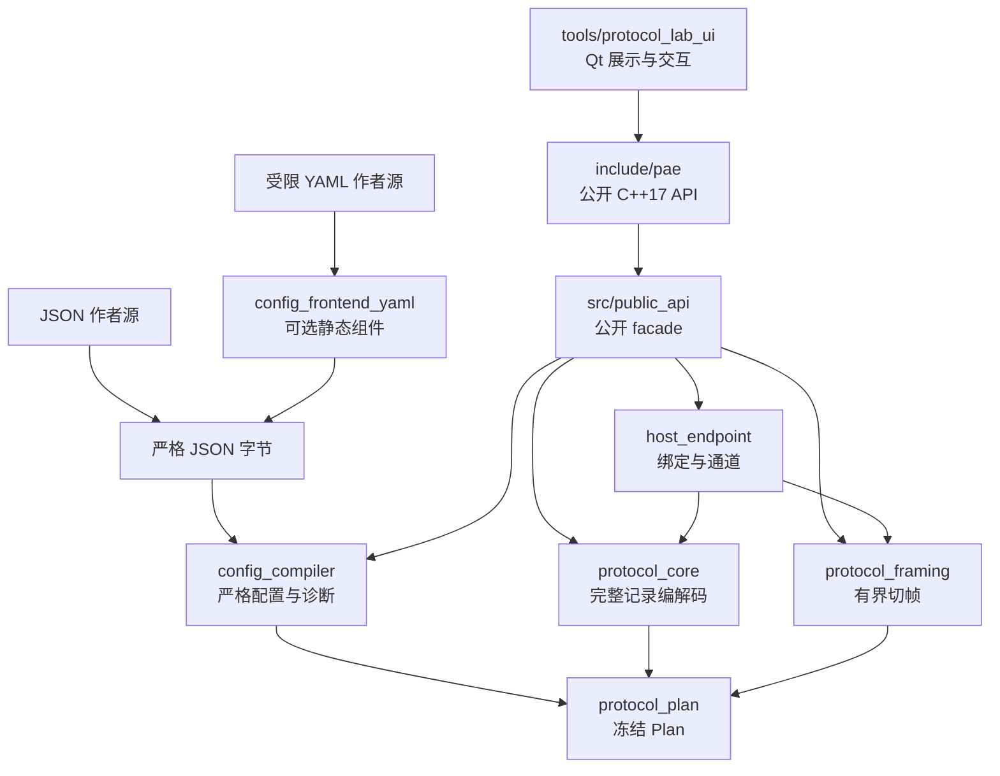

# 05 架构与代码阅读

## 适用读者

需要修改 PAE 公开 API、Compiler/Plan/Core/Framer/Host，或追踪 Qt Lab 如何消费这些能力的维护者。

## 前置条件

- 已读 [01 项目定位与能力边界](01-项目定位与能力边界.md)；
- 明确当前任务是理解代码、修改某层实现，还是核对历史证据；
- 先读取适用 `AGENTS.md` 和实时 Git 状态，不从历史“下一步”推导当前授权。

## 读完能做什么

读完后可以从公开 API 找到实现落点、示例、Schema 与 Lab 投影，并针对一个小调用回路选择最少文件，而不是通读全部历史报告。

## 1. 权威性顺序

当前用户授权和 `AGENTS.md` → 当前源码/CMake → Schema 与公开头注释 → 对应专项契约/验证 → 历史归档。

验证报告证明的是当时列明的输入、配置和平台；源代码已变化时，应重新核对，不能让旧报告覆盖当前事实。

## 2. 架构地图


```mermaid
flowchart TD
    Author["JSON 作者源"] --> StrictJson["严格 JSON 字节"]
    YamlAuthor["受限 YAML 作者源"] --> YamlFrontend["config_frontend_yaml<br/>可选静态组件"]
    YamlFrontend --> StrictJson
    StrictJson --> Compiler
    Public["include/pae<br/>公开 C++17 API"] --> Facade["src/public_api<br/>公开 facade"]
    Facade --> Compiler["config_compiler<br/>严格配置与诊断"]
    Compiler --> Plan["protocol_plan<br/>冻结 Plan"]
    Facade --> Core["protocol_core<br/>完整记录编解码"]
    Facade --> Framing["protocol_framing<br/>有界切帧"]
    Facade --> HostImpl["host_endpoint<br/>绑定与通道"]
    Core --> Plan
    Framing --> Plan
    HostImpl --> Core
    HostImpl --> Framing
    Lab["tools/protocol_lab_ui<br/>Qt 展示与交互"] --> Public
```

作者源箭头表示配置流向，其余箭头表示代码依赖方向。YAML 前端只转换为严格 JSON，仍由原 Compiler 判断 Schema、引用和执行规则；Qt Lab 消费公开组件，PAE Core 不依赖 Qt。Core 不应在热路径重新解释作者源。

## 3. 五站阅读法

1. **公开面**：先读 [`include/README.md`](../../include/README.md)，再按问题打开 `compiler.h`、`protocol_description.h`、`codec.h`、`stream_framer.h`、`host_endpoint.h`；可选 YAML 组件的公开头位于 `src/config_frontend_yaml/public/pae/yaml_frontend.h`，安装包中为 `include/pae/yaml_frontend.h`。
2. **公开实现**：对应读 `src/public_api/{compiler,codec,stream_framer,host_endpoint}.cpp`；`compiled_state_internal.h` 是共享冻结状态边界，不是 consumer 头。
3. **可运行示例**：综合路线看 `examples/public_api_sdk_consumer/`；小回路看 `public_api_compile`、`public_api_codec`、`public_api_framer`、`public_api_host`。
4. **配置契约**：从 [`schema/README.md`](../../schema/README.md) 选协议版本，再查 Schema、执行语义和 strict JSON profile；YAML 作者源另查 [Profile V0.1](../../schema/pae_yaml_profile_v0.1.md)，不能把 YAML 1.2 当作 PAE Schema 版本。
5. **Lab 投影**：最后读 `tools/protocol_lab_*`，确认 UI 只映射/展示公开事实。

## 4. 按问题选最小文件集

| 问题 | 先读 | 实现/示例 |
| --- | --- | --- |
| 配置为何失败 | `include/pae/compiler.h` | `src/public_api/compiler.cpp`、`schema/*` |
| YAML 转换与原文位置 | `src/config_frontend_yaml/public/pae/yaml_frontend.h` | `public_facade.cpp`、`frontend.cpp`、`examples/yaml_sdk_consumer/` |
| Pipeline/Message/Field metadata | `compiler.h`、`protocol_description.h` | 综合 SDK consumer |
| 完整记录编解码 | `include/pae/codec.h` | `src/public_api/codec.cpp`、`examples/public_api_codec/` |
| 分块输入如何切帧 | `include/pae/stream_framer.h` | `src/public_api/stream_framer.cpp`、`examples/public_api_framer/` |
| 多逻辑通道怎样绑定 | `include/pae/host_endpoint.h` | `src/public_api/host_endpoint.cpp`、`examples/public_api_host/` |
| SDK target 从哪里来 | `src/public_api/CMakeLists.txt` | 包内 `lib/cmake/PAE/` 与 consumer CMake |
| ASCII Lab 接线 | `tools/protocol_lab_ascii/public_ascii_*` | `ascii_host_adapter.cpp`、`document_session.cpp` |
| Binary UI 边界 | `tools/protocol_lab_binary/public_binary_decode.*` | `binary_host_adapter_public.*`、`schema_dispatch.cpp` |
| installed SDK Lab | `tools/protocol_lab_ui/standalone/CMakeLists.txt` | 输入准备与 Deploy CMake |

`PAE::yaml_frontend` 为可选静态附加组件；JSON-only 包没有它，shared PAE 仍是同包 `pae.dll`。查看安装树时，区分包内 `examples/`、`share/pae/examples/config/` 与仓库 `examples/config/`，不要从当前开发树给独立 SDK consumer 偷取私有源码或配置。

读 SDK target 时从 `PAE::pae` 的传递接口入手：当前 Static 包还链接五个内部 `.lib`，不能把原生 VS/qmake 接入简化为一个 `pae.lib`。切换包后若仍读到旧目标，检查 CMake cache 的 `PAE_DIR`；仅改 `CMAKE_PREFIX_PATH` 不会自动清除它，优先新建 BuildRoot。Source 模式应区分独立运行旧包内示例与宿主直接受控 `add_subdirectory`；前者的全局 `BUILD_TESTING FORCE` 不适合嵌入有自身 CTest 的宿主。实验和停点见 [接入审计](../engineering/developer-integration-audit-20260926.md)。

## 5. 一条小调用回路

以 JSON 完整记录 Decode 为例：

```text
CompileProtocolJson
  -> CompiledProtocol::Pipeline()/Message()/Field()
  -> CreateCompleteRecordCodec
  -> CompleteRecordCodec::Decode
  -> DecodeResult / borrowed DecodedRecordView
```

阅读时先确认 index 来自公开查询还是调用者约定，再看错误状态与 view 寿命。不要先跳到 Qt model，也不要从私有 `PlanBundle` 反推 consumer 用法。`CompiledProtocol` 查询出的 metadata 字符串是借用 view，owner 移动、替换或销毁后须重查或事先复制；Codec/Framer/Host 创建时分别持有冻结 `CompiledStateRef`，这保证执行状态，不会让旧 metadata view 自动延寿。

YAML 路线只在编译前多一步 `pae::yaml::ConvertToStrictJson`：成功后保留拥有式转换结果，将其 `Json()` 交给 `CompileProtocolJson`。失败时没有可用 JSON；来源查询结果可为精确位置、最近祖先近似位置或未映射。生成 JSON 的 offset 不是原 YAML offset，移动或销毁转换 owner 后不得继续使用其借用视图。Lab 在 worker 线程执行转换与编译，`DocumentTab` 展示诊断和结果，不另建协议执行引擎。

流式路径只在前面增加 `CreateStreamFramer` 与 `Push/Continue`；每个同步候选可以交给 Codec。候选形成、Codec 尝试、Decode 成功和业务 callback 返回是四个不同事实。按 [公开头](../../include/README.md) 追踪时，优先检查以下交付边界：

- 完整记录用 Codec；分块流用 Framer 得到候选；需要端点/方向绑定和回调编排时才用 Host，不把三者当作固定串行层级。
- Codec 的 record/field view 借执行实例，BYTES 还借未修改输入；Framer/Host 回调数据只在同步回调内有效。跨调用保存要复制，同实例调用须串行，不在回调中重入。
- Encode 失败时 `bytes_written=0`，可能已改动的输出 Buffer 不能发送；Host 只有交付状态 `OK` 才表示业务回调正常返回，成功 Reset 后须重新 `Find` handle。具体状态与失效条件以 `codec.h`、`stream_framer.h`、`host_endpoint.h` 为准。

## 6. Lab 的特殊边界

Lab 典型阅读顺序：

```text
main.cpp / ApplicationWindow
  -> DocumentTab / DocumentSession
  -> SchemaDispatch（只分类顶层 schema_version）
  -> public ASCII/Binary adapter
  -> PAE public Compiler / Codec / Framer / Host
```

`schema_dispatch.cpp` 不应变成第二个协议编译器。`description_mapping.*`、`owned_presentation_types.h` 和 Qt model/delegate 只处理展示所有权与格式化，不改变执行语义。Binary UI 已接入完整 Decode/Encode 与 G2 流式；流式 owner 仍在 `tools/protocol_lab_binary/public_binary_decode.*`，再看 adapter、Session 与 DocumentTab。ASCII 0.10/0.11 的公开/兼容路径由构建开关决定，不能从 UI 支持版本推断实际消费路径。

## 7. 中文注释阅读路线

当前开发树的关键执行与展示边界已补充中文注释。建议带着一条配置和一条报文，按下表逐站阅读；不必先通读所有实现或历史验证报告。

| 站点 | 源码入口 | 本站要回答的问题 |
| --- | --- | --- |
| 作者源进入编译器 | [公开编译入口](../../src/public_api/compiler.cpp)、[YAML 前端](../../src/config_frontend_yaml/frontend.cpp) | JSON/YAML 在哪里汇合？语法、Schema、资源和来源位置分别由谁处理？ |
| 配置成为冻结状态 | [配置编译器](../../src/config_compiler/config_compiler.cpp)、[Plan 构建](../../src/protocol_plan/plan_builder.cpp)、[共享状态](../../src/public_api/compiled_state_internal.h) | 何时检查、分配、冻结及发布？失败由哪个 owner 回收？ |
| 展示元数据与执行规则分离 | [metadata 声明](../../src/config_compiler/protocol_metadata.h)、[存储与审计](../../src/config_compiler/protocol_metadata.cpp) | 文本存在哪里？span/index 指向什么？查询视图借用谁？Audit 不保证什么？ |
| 一条完整记录执行 | [公开 Codec](../../src/public_api/codec.cpp)、[Core](../../src/protocol_core/complete_record_codec.cpp)、[Decimal 转换](../../src/protocol_core/decimal_conversion_internal.cpp) | raw 与 logical 如何区分？精确反算为何可能失败？结果和输入各自要活多久？ |
| 分块流与宿主编排 | [公开 Framer](../../src/public_api/stream_framer.cpp)、[公开 Host](../../src/public_api/host_endpoint.cpp) | 候选何时形成？STOP/Continue、Reset、handle 和同步回调有什么边界？ |
| Lab 消费而不重做执行 | [DocumentTab](../../tools/protocol_lab_ui/document_tab.cpp)、[字段模型](../../tools/protocol_lab_ui/field_table_model.cpp)、[描述映射](../../tools/protocol_lab_ui/description_mapping.cpp)、[Hex 展示](../../tools/protocol_lab_ui/hex_view.cpp) | 表格借用什么、Hex 复制什么？成功、失败、未知 Message 各显示什么？实际范围和描述范围为何不能混用？ |

Lab 最后一站优先搜索 `RefreshInspect`、`RefreshPreview`、`RefreshFieldDetails`、`DisplayedMessage`，再追 `FieldTableModel::ApplyResults/data` 与 `HexView::Model::SetFrame`。公开 Binary 描述另经 `public_binary_description.*`，不能把兼容 Plan 映射当作所有构建的统一入口。

阅读到每站时，只记四项：**输入是什么、谁拥有数据、失败后什么仍有效、对应测试保护什么**。不要把注释中的调用前提当作运行时防御，也不要把逻辑容量计费当作进程 RSS 上限。发现疑问再进入相应测试，而非要求先掌握全部内部算法。

本轮最后三个专项的证据入口：

- [Decimal 转换注释验证](../engineering/chinese-comments-decimal-conversion-validation-20261009.md)：Windows Debug/Release 各 3 项。
- [metadata 注释验证](../engineering/chinese-comments-metadata-validation-20261009.md)：Windows Debug/Release 各 3 项。
- [Lab 展示注释验证](../engineering/chinese-comments-lab-display-validation-20261009.md)：Windows Debug/Release 各 5 项，含自动 Qt 烟测，不等于新的人工验收。

这些记录不是全域正确性或生产可用证明。本轮源码注释不自动进入旧 SDK/体验包；包的源码身份仍以 [交付入口](../../deliverables/README.md) 为准。后续按真实阅读和使用中暴露的疑问补充，不以每个函数都有中文注释作为上手门槛。

## 8. 修改前的停点

- 公共头、根 CMake、Schema 和 Qt UI 是不同变更面；先缩小范围；
- shared ABI、borrowed view、同步 callback、Reset/Handle generation 都是高风险边界；
- 构建通过、CTest、人工 UI、SDK 包外消费、硬件和现场验收分别记录；
- 需要精确契约时进入 [工程依据索引](../engineering/README.md)，不要把整个 `docs/engineering` 当成顺序教程。

下一篇：[06 构建测试与问题定位](06-构建测试与问题定位.md)。
