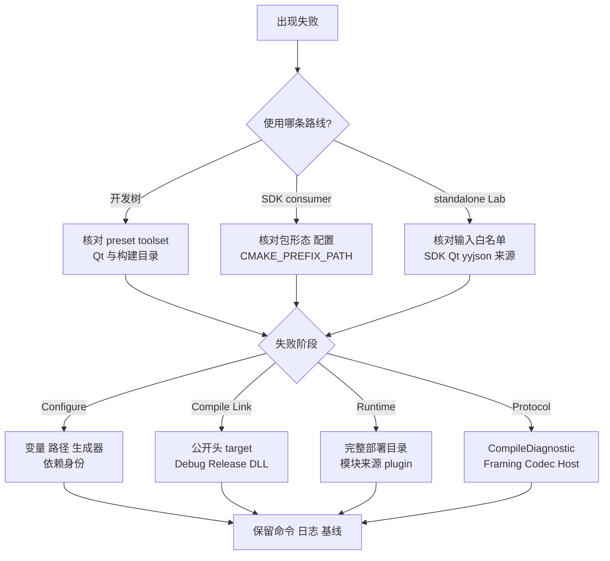

# 06 构建测试与问题定位

## 适用读者

需要从开发树构建 PAE/Qt Lab、运行与改动相称的测试，或定位 Configure、链接、DLL、配置编译和运行问题的维护者。

## 前置条件

- Windows 构建使用 Visual Studio Developer Shell；
- 当前推荐组合要求 `Visual Studio 18 2026`、x64、`v142,version=14.29.30133`；
- 不把 `C:\Strawberry\c\bin` 下的 `gcc/g++/gdb` 当作已验证 MinGW；
- 先确认工作树中已有变更和目标构建目录归属。

## 读完能做什么

读完后可以选择开发树、SDK consumer 或 standalone Lab 的正确入口，按失败发生层次定位问题，并清楚说明“验证了什么、没有验证什么”。

## 1. 先选构建路线

| 目标 | 入口 | 不要混用 |
| --- | --- | --- |
| 开发树 PAE + Qt Lab | `windows-msvc-pae-lab` preset | 不用裸 EXE 代替部署目录 |
| 开发树公开 API | `windows-msvc-public-api-stage1` | 不代表 installed SDK 包外消费 |
| 现有 SDK consumer | [03 Windows SDK 集成](03-Windows-SDK集成.md) | 构建目录放包外 |
| installed SDK 完整 Lab | `tools/protocol_lab_ui/standalone/README.md` | 不回读 PAE 开发源码树 |

开发树推荐命令：

```powershell
Set-Location 'F:\PersonalWorkspace\协议解析拼接工具\protocol_adapter_engine'
cmake --preset windows-msvc-pae-lab
cmake --build --preset windows-msvc-pae-lab-debug
ctest --preset windows-msvc-pae-lab-debug

cmake --build --preset windows-msvc-pae-lab-release
ctest --preset windows-msvc-pae-lab-release
```

构建后从完整部署目录启动：

```powershell
& .\out\build\windows-msvc-pae-lab\out\protocol_lab_ui\Release\pae_protocol_lab_ui.exe
```

`bin/Release/pae_protocol_lab_ui.exe` 只是链接产物，不保证旁边已有 Qt plugin、配置和全部运行库。

## 2. 排错顺序



一次只回答一个阶段的问题。不要用“后来某次通过”覆盖首次失败，也不要在定位 DLL 时顺便改协议配置。

## 3. 常见失败

### Configure 失败

- `PAE_QT_ROOT`：开发树 Qt Lab 要求固定 Qt 5.13.x 输入；不是本机 Qt 5.11.3 全局目录；
- standalone 的 `PAE_SDK_ROOT` 必须精确指向一个包根，`PAE_LAB_EXPECTED_LIBRARY_KIND` 与 Static/Shared 匹配；
- `CMAKE_PREFIX_PATH` 指错到五包父目录时，`find_package(PAE)` 不一定得到预期包；
- 旧 build cache 可能记住另一 SDK/Qt 路径。不要覆盖既有证据目录，使用新的精确构建目录。

### 编译或链接失败

- consumer 只 include `pae/*.h` 并链接 `PAE::pae`；
- Debug 包配 Debug、Release 包配 Release；
- `PAE_SDK_CONFIGURATION_MISMATCH_EXPECTED_*_PACKAGE` 是配置错配门禁；
- shared 的 import library 与运行时 `pae.dll` 必须来自同一包。

### 启动失败

- 从部署目录启动，检查 Qt DLL 与 `platforms/qwindows*.dll`；
- shared 再检查同级 `pae.dll`；
- 记录实际加载模块路径，不通过全局 `PATH` 或复制未知 DLL 暂时绕过。

### 配置或执行失败

- Compile 失败先查看右侧“诊断与计时”：新Lab分项显示阶段、错误码、JSON位置、字节偏移、资源信息和原始技术详情，记录这些内容与配置文件即可。
- 空JSON pointer表示根位置；字节偏移“未提供”与0不同；资源类型NONE时“无资源预算数据”不表示预算为0。例如STRUCTURAL / MISSING_PROPERTY /protocol_id表示缺少必填属性，应按Schema补齐，不是报文解析失败。
- 文件读取、分类或运行期错误没有编译诊断时仍保留原操作失败提示，不伪造结构化字段；技术详情和英文错误token保持原样以便检索。
- 完整记录和 stream chunk 输入种类不匹配会被拒绝；
- Framer 候选形成不等于 Message 匹配或 Decode 成功；
- callback 失败可能保留“已消费/已调用”的事实，但业务交付未完成；Host 进入 `RESET_REQUIRED` 时按公开状态处理，不猜测回滚。

## 4. 验证强度怎样选

| 改动 | 最少验证 | 仍未覆盖 |
| --- | --- | --- |
| 纯文档链接 | 链接、锚点、命令目标静态检查 | 构建与运行 |
| 单个实现内部改动 | 对应 target + 定向 CTest | 其他配置与 UI |
| 公共 API/Schema | Debug/Release、consumer、负例 | ABI、Linux、真实协议 |
| Qt UI | 自动测试 + 简短人工 UI | 硬件与现场 |
| SDK/部署 | 包外 consumer、文件 Hash、模块来源 | 正式发布与许可 |

共享接口、所有权、并发、持久化、硬件或发布相关改动需要更广验证。静态审查、构建、测试、人工观察和现场验收不能互相替代。

## 5. Linux 与清理边界

`linux-gcc-spike`、`linux-clang-spike` 是早期 parser spike 预设，不证明当前公开 SDK、Core 或 Lab 已在 Linux 验证。没有真实 Linux 环境时应写“未验证”，不要由 CMake 文件存在推导支持状态。

构建树位于被忽略的 `out/`，但其中可能夹有日志和人工证据。清理前必须先归集、Hash 校验并使用精确白名单；不要删除整个 `out`，也不要用通配符批量删除 `pae-*` 外部根。

## 6. 记录一次可复核结果

至少记录：分支与 HEAD、工作树状态、完整命令、生成器/toolset、Debug/Release、SDK/Qt 来源、通过/失败计数、日志路径，以及未验证范围。失败时保留第一现场；成功时不要把局部结论扩大为稳定 ABI、Linux、硬件或生产证明。

返回 [开发者指南目录](README.md)，或按问题进入 [工程依据索引](../engineering/README.md)。
