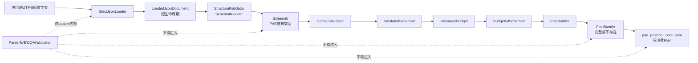

# PAE V0.1 Loader 与 Compiler 架构边界

## 1. 文档控制

| 项目 | 内容 |
| --- | --- |
| 文档名称 | PAE V0.1 Loader 与 Compiler 架构边界 |
| 文档版本 | 0.1.9 |
| 文档日期 | 2026-09-02 |
| 适用范围 | `ProtocolAdapterEngine` V0.1 配置加载和内存执行计划编译链 |
| 文档属性 | 仓库内架构边界文档，不是公共接口参考 |

### 1.1 状态说明

本文同时包含四种状态，阅读和实现时必须区分：

| 状态 | 含义 | 本文中的内容 |
| --- | --- | --- |
| `CONFIRMED PRINCIPLE（已确认原则）` | 已由上层《PAE V0.1 技术细节拍板方案》确认，当前实现必须遵守 | 严格 JSON、执行链顺序、第三方类型隔离、不可变 Plan、失败关闭和资源有界原则 |
| `ARCHITECTURE DRAFT（本轮架构草案）` | 本轮对组件职责、IR、生命周期和失败边界形成的设计草案 | 各组件的输入输出、类型状态、诊断阶段和最小垂直切片 |
| `CONFIRMED TARGET / UNVERIFIED（已确认目标 / 未验证）` | 上层Decision已经确认职责与不变量，但源码和测试尚未闭合 | 不可伪造的Validated/Budgeted Draft（已验证/已预算草案）能力边界、Validator（校验器）单一规则权威、冷Plan实际占用和Runtime（运行时）活跃内存准入 |
| `INTERFACE OPEN（未冻结接口）` | 尚未进入 API Specification（应用程序接口规范），名称、字段和数值仍可调整 | 本文全部 C++ 概念接口、具体错误码数值、结构体布局、五项Loader容量候选的最终数值和最终 Parser 类型 |

截至2026-09-02，本文描述的编译链已经落地内部、不可安装、不可导出的最小可执行切片；`ProtocolPlan`类型也已从`config_compiler`抽离为不依赖yyjson的`pae_protocol_plan`内部目标，并完成首个Frozen Execution Plan（冻结执行计划）与`COMPLETE_RECORD（完整记录）`Codec（编解码器）衔接。第十五轮`PAE-DEC-032/033`进一步确认类型能力边界、单一规则权威和完整内存准入目标，但没有把当前实现升级为已验证状态，也没有冻结概念接口中的具体C++名称或布局。

本文没有把架构草案升级为新的用户拍板，也没有修改上层已确认决策。若本文与后续用户确认或专项规范冲突，以后者为准。

### 1.2 文档目的

本文冻结配置编译链的方向和职责边界：

```text
StrictJsonLoader
→ StructuralValidator / SchemaIrBuilder
→ DomainValidator
→ ResourceBudget
→ PlanBuilder
```

本文重点防止以下问题：

- Parser（解析器）私有类型进入协议 Core、Plan 或公共头文件；
- Structural Validation（结构校验）与 Domain Validation（领域校验）互相混杂；
- 未经过领域校验的配置进入 PlanBuilder；
- PlanBuilder重复解释 JSON 或承担配置纠错职责；
- Parser DOM（Document Object Model，文档对象模型）在 Plan 和逐帧路径中长期存活；
- 配置失败后留下部分注册对象或不可恢复的 Runtime 状态。

### 1.3 非目标

本文不定义：

- 首个内部Protocol Core Codec的Decode（解析）、Encode（组包）执行语义、测试结果或稳定接口；本文只记录它与配置编译链的依赖隔离；
- Framer（切帧器）、Integrity（完整性校验）、Receive Gate（接收门禁）、Mapping（映射）和Session（会话）；
- C++公共 API（Application Programming Interface，应用程序接口）或 C ABI（Application Binary Interface，应用二进制接口）；
- 最终 JSON Parser 选型；
- `pae.schema.json`的完整字段级结构；
- ProtocolPlan内存布局和运行期操作码；
- 错误码数值分配；
- Runtime注册、Session执行和报文性能结论。

## 2. 术语

| 术语 | 含义 |
| --- | --- |
| PAE | `Protocol Adapter Engine（协议适配引擎）` |
| JSON | `JavaScript Object Notation（JavaScript对象表示法）` |
| Loader | 读取和严格解析配置输入的加载器 |
| Compiler | 将结构合法、领域合法的配置编译为内存执行计划的配置编译链 |
| IR | `Intermediate Representation（中间表示）` |
| DOM | `Document Object Model（文档对象模型）`，Parser产生的内存解析树 |
| Structural Validator | 结构校验器，执行对象结构、属性、局部类型和局部约束校验 |
| SchemaIrBuilder | 把结构合法的JSON节点转换为PAE自有类型化Schema IR的构建器 |
| Domain Validator | 领域校验器，执行跨字段、跨引用、方向、布局和执行语义校验 |
| ResourceBudget | 资源预算校验阶段，判断Schema和预计Plan是否满足Hard Limit（硬性安全上限）及Profile（资源档位） |
| PlanBuilder | 把已验证、已解析引用的IR机械编译为不可变Plan的构建器 |
| ProtocolPlan | 单个协议包的不可变协议执行计划 |
| PipelinePlan | 单条有向处理管线的不可变执行计划 |
| JSON Pointer | JSON逻辑路径，例如`/messages/0/fields/2` |
| UTF-8 | `Unicode Transformation Format 8-bit（8位Unicode转换格式）` |

## 3. 冻结的执行链

### 3.1 权威顺序

配置只能按以下顺序前进：

```text
输入UTF-8字节
→ StrictJsonLoader
→ LoadedJsonDocument
→ StructuralValidator / SchemaIrBuilder
→ SchemaIr
→ DomainValidator
→ ValidatedSchemaIr
→ ResourceBudget
→ BudgetedSchemaIr
→ PlanBuilder
→ 完整PlanBundle
```

其中：

- `PlanBuilder`必须位于`DomainValidator`和`ResourceBudget`之后；
- 任一阶段失败时，后续阶段不得执行；
- `PlanBuilder`不得接收Parser DOM、通用JSON节点或未验证`SchemaIr`；
- Runtime注册不属于上述编译链，只有完整`PlanBundle`产生后才可单独进行；
- 逐帧运行路径不得进入Loader、Validator或PlanBuilder。

### 3.2 组件关系



本图只表达架构关系；本文未执行Mermaid实际渲染。

## 4. 组件职责

### 4.1 StrictJsonLoader

`StrictJsonLoader`只负责输入格式和Parser资源安全。

#### 输入

- 借用的配置字节和显式长度；
- Loader输入及Parser资源上限；
- Loader私有工作区或Allocator（内存分配器）策略。

#### 负责

- 输入总字节数上限；
- UTF-8合法性；
- UTF-8 BOM（Byte Order Mark，字节顺序标记）拒绝；
- 严格JSON语法；
- 注释、尾随逗号、`NaN`、正负无穷和JSON5扩展拒绝；
- 重复key在覆盖前失败；
- Parser语法错误和Parser allocator失败转换；
- DOM节点数、嵌套深度、单字符串长度和单数组长度审计；
- Number Token（数字词法单元）种类和精确整数值保真；
- 产生短生命周期、只读的`LoadedJsonDocument`。

#### 不负责

- 不认识`protocol_id`、Message、Field、FramingProfile等领域属性；
- 不解析字段引用、方向或协议布局；
- 不判断字段重叠、Matcher歧义或Integrity范围；
- 不创建`SchemaIr`或Plan；
- 不向Runtime注册任何对象。

#### 输出要求

`LoadedJsonDocument`必须是move-only（仅移动）对象，并通过PAE自有的内部只读View暴露节点。Parser具体DOM类型只能隐藏在Loader私有实现中。

Number Token至少需要区分：

```text
SIGNED_INTEGER
UNSIGNED_INTEGER
REAL
```

任何64位整数不得经过`double`中转。

### 4.2 StructuralValidator / SchemaIrBuilder

结构校验和Typed IR（类型化中间表示）构建应在同一次遍历中完成，避免先完整验证、再重复遍历一遍DOM。

#### 输入

- 只读`LoadedJsonDocument`；
- Structural局部限制；
- 当前`schema_version`对应的结构规则。

#### 负责

- 根节点类型；
- 必填属性；
- 未知属性拒绝；
- JSON基础类型；
- 枚举字符串和稳定ID的局部格式；
- JSON Schema能够局部表达的`minimum`、`maximum`、长度和数组局部约束；
- 局部`oneOf`、互斥属性和属性组合；
- 要求整数的属性拒绝`1.0`或指数形式；
- 十六进制字符串、字节模式等局部词法格式转换；
- 把字符串枚举转换为PAE内部枚举；
- 构建拥有自身数据的`SchemaIr`；
- 为重要声明保存可恢复JSON Pointer的`ConfigOrigin`。

#### 不负责

- 不解析跨对象引用；
- 不判断ID在不同对象间是否重复；
- 不判断字段布局、bit容器、方向或Framing兼容；
- 不判断computed依赖环、Matcher重叠或Mapping类型兼容；
- 不执行Hard Limit和Runtime总内存准入；
- 不创建Handle和Plan运行期数组。

#### 输出要求

`SchemaIr`必须：

- 完全使用PAE自有类型；
- 拥有字符串、数组和精确整数；
- 引用暂时保存稳定ASCII ID，不保存Parser节点；
- 区分属性缺省与显式出现；
- 保留领域诊断所需的配置来源路径；
- 不依赖JSON对象成员书写顺序；
- 不包含任何第三方Parser类型。

### 4.3 DomainValidator

`DomainValidator`负责判断“结构上能读懂的配置”是否能够形成确定、安全的协议执行语义。

#### 输入

- move-only `SchemaIr`；
- 当前有效的算法注册表只读快照；
- Schema版本和Execution Semantics（执行语义规范）；
- Hard Limit和Profile语义参数。

#### 负责

- Protocol、FramingProfile、Pipeline、Message和Field ID唯一性；
- 所有稳定ID引用解析；
- Pipeline方向与Message方向兼容；
- Pipeline和FramingProfile兼容；
- 字段byte/bit布局、越界、重叠和bit容器一致性；
- 长度字段公式及依赖；
- Message Matcher确定性和静态可发现歧义；
- computed字段依赖和循环；
- Integrity字段、范围和算法引用；
- scale/bias的精确有理数语义及溢出前置检查；
- `encode_source`与字段属性兼容；
- Mapping来源、目标和类型兼容；
- 后置能力没有以未知或忽略属性潜入V0.1；
- 把稳定ID引用解析为内部索引；
- 形成computed拓扑顺序、标准化布局和算法Handle。

#### 不负责

- 不解释原始JSON Token；
- 不访问Parser DOM；
- 不分配最终ProtocolPlan和PipelinePlan；
- 不修改Runtime或Extension Registry（扩展注册表）；
- 不通过猜测修复配置。

#### 输出要求

已确认的能力边界要求只有`DomainValidator`可以构造Validated状态；本文以`ValidatedSchemaIr`作为概念名称。该状态建议包含：

```text
SchemaIr所有权
+ 已解析引用表
+ 标准化字段布局
+ Matcher分析结果
+ computed依赖顺序
+ 已解析算法Handle
+ 领域资源需求
```

它可以是对原`SchemaIr`的move-only包装，不要求复制整份配置。

### 4.4 ResourceBudget

`ResourceBudget`是独立的语义门禁，不能与Parser防恶意输入的资源限制混为一谈。

#### Loader资源限制

用于保护配置解析过程，例如：

- 最大输入字节；
- Parser arena（解析器内存区）；
- DOM节点、深度、单Object成员、字符串、数组和Number Token上限；
- 全部解码字符串字节和Loader/Compiler峰值临时内存。

第十三轮已经冻结深度、单Object成员、单Array元素、单字符串和Number Token五项结构上限；输入、逻辑DOM节点、全部解码字符串、Parser arena和Loader/Compiler峰值临时内存目前只确认为`CANDIDATE / UNVERIFIED（候选、未验证）`。精确数值以`schema/strict_json_profile_v0.1.md`为当前专项权威，第三方Parser默认值不得替代PAE限制。

当前Windows Spike已为三档执行五项结构上限，以及输入、逻辑DOM节点和全部解码字符串的exact/+1（恰好到上限/超限一级）Parser阶段门禁；Parser arena已执行候选容量充分、硬边界和耗尽清理检查。内部Loader切片另已构建最小SchemaIr和PlanBundle并验证失败时无部分Plan。上述结果仍未覆盖正式最大规模PAE配置、SHA-256清单、Loader/Compiler峰值或Runtime注册，不能据此冻结生产容量。

#### Plan/Runtime资源预算

用于判断配置形成的协议计划是否满足：

- 单Message字段数；
- 单Plan总字段数和Message数；
- 最大完整帧；
- Pipeline、Session工作区需求；
- Desktop Baseline或Constrained Profile；
- V0.1 Hard Limit；
- 所有容量累计的整数溢出检查。

#### 输入和输出

输入为Validated状态和显式有效限制。成功后产生只有`ResourceBudgetValidator`能够构造的Budgeted状态，本文以`BudgetedSchemaIr`作为概念名称；它携带已经验证的`ResourceRequirements`。

`PlanBuilder`不能通过“尝试分配直到失败”代替ResourceBudget校验。

`PAE-DEC-033`进一步确认：冷Plan预算至少覆盖最终拥有的Matcher字节、字符串、容器、执行描述符和索引；Runtime注册Plan和创建Session前必须对全部活跃Plan/Session执行checked aggregate admission（受检总量准入），失败时无部分注册、无overcommit、无lazy allocation。同一Runtime内共享Plan只计一次，各Session按实际预留分别计入并在销毁后归还。精确计费单位、Allocator开销、容器布局和资源报告公共字段仍是实现规格待定项。

### 4.5 PlanBuilder

目标架构中，`PlanBuilder`只负责把已经完成结构、领域和资源校验的模型机械转换为不可变执行计划。当前Frozen Execution Plan（冻结执行计划）内部切片已经实现受限构造和执行描述符，但仍保留一层过渡性防御复核，具体边界见本节末尾。

#### 输入

- `BudgetedSchemaIr`；
- Plan创建阶段Allocator；
- 不可变算法注册信息；
- Plan构建私有上下文。

#### 负责

- 分配Message、Field、Pipeline等内部索引和Handle；
- 固化必要字符串和诊断身份；
- 编译Matcher查找结构；
- 编译字段读取/写入描述、bit mask和shift；
- 编译computed执行顺序；
- 固化Integrity算法Handle和参数；
- 计算并建立Plan内部连续数组或其他最终布局；
- 成功后一次性交付完整`PlanBundle`。

#### 不负责

- 不读取或解释JSON；
- 不再次进行Schema策略选择；
- 不接受未验证引用；
- 不补默认字段、不隐式补零、不修复冲突；
- 不修改Runtime；
- 不执行报文Decode、Encode或Framing。

如果`PlanBuilder`在合法`BudgetedSchemaIr`中发现字段重叠、引用不存在或Matcher冲突，应返回`INTERNAL_CONTRACT_VIOLATION`或等价内部错误，表示Validator存在缺口，而不是重新归类为普通用户配置错误。

当前实现尚未把`SchemaIr → ValidatedSchemaIr → BudgetedSchemaIr`落实为不可伪造的不同C++类型。Config Compiler先执行Domain/Resource检查，再把`PlanDraft`交给`PlanBuilder::Freeze`；Builder会重新计算资源需求，并防御性重查当前COMPLETE_RECORD子集的字段布局、Matcher、引用、覆盖和歧义。该做法能保证任何内部调用者都不能绕过安全门禁，但与“已验证IR只做描述符生成和尾部不变量审计”的最终职责仍有重复。

`PAE-DEC-032`已经确认只有Validator能够构造`Validated/Budgeted Draft（已验证/已预算草案）`能力状态，并要求规则只有一个语义权威来源；当前源码仍未实现该目标，因此不应直接删除Builder检查。落地时必须同时满足：作者友好诊断仍由Config Compiler产生，直接内部草案入口不能伪造已验证状态，冻结尾部错误只表示资源闭合或内部契约缺陷。

## 5. IR设计决策

### 5.1 需要Typed IR

V0.1需要PAE自有Typed IR，原因是：

- 隔离Parser实现；
- 让Domain Validator不依赖JSON库；
- 保证精确整数和协议枚举不经字符串反复解释；
- 允许Parser DOM在Structural阶段后立即释放；
- 让PlanBuilder只接收确定的类型化模型；
- 为跨平台一致性语料提供稳定观察点。

### 5.2 不需要第二份持久通用JSON DOM

不建议在Parser DOM之外再复制一棵PAE通用JSON树。推荐：

```text
Parser私有DOM
→ 临时JsonDocumentView
→ 一次遍历生成SchemaIr
```

这样可以避免双DOM内存、重复字符串和额外生命周期。

### 5.3 类型状态

已确认必须用不可伪造的不同类型状态表达校验阶段；下列名称仍是概念接口，不是已冻结公共C++ API：

```text
SchemaIr
→ ValidatedSchemaIr
→ BudgetedSchemaIr
→ PlanBundle
```

后三种类型使用受限构造函数和move-only所有权，使错误阶段无法通过普通调用绕过。

## 6. 第三方类型隔离

### 6.1 模块边界

当前内部目标的实际依赖方向为：

```text
pae_config_compiler
├── PRIVATE → pae_protocol_plan
└── PRIVATE → pae::yyjson_candidate
               └── PRIVATE → vendored yyjson source

pae_protocol_core_slice
└── PRIVATE → pae_protocol_plan

pae_protocol_plan
└── 不依赖config_compiler、yyjson或其他第三方Parser
```

这些是当前CMake实现名称，不安装、不导出，也未冻结为公共兼容名称。

### 6.2 硬规则

- 第三方Parser头文件只能出现在私有Loader Backend和经审计的`third_party`范围；
- 第三方类型不得进入公共头、跨层内部接口、`SchemaIr`、诊断对象、ProtocolPlan或PipelinePlan；
- 第三方include目录不得通过`PUBLIC`或`INTERFACE`传播；
- Parser错误必须在StrictJsonLoader出口前映射为PAE稳定诊断；
- Parser DOM和Parser arena必须在Structural阶段完成后完全释放；
- Domain、ResourceBudget、PlanBuilder、`pae_protocol_plan`和当前Protocol Core目标必须能在不提供第三方include路径时单独编译；
- Spike中的候选特定Probe Schema校验逻辑不得复制到正式Loader Backend；
- V0.1运行期不执行通用第三方JSON Schema Validator；独立Draft 2020-12 Validator只用于编辑器、工具和一致性门禁。

## 7. 所有权和生命周期

### 7.1 正常路径

```text
调用方借出配置字节
→ Loader创建Parser arena和DOM
→ Structural阶段复制并类型化为SchemaIr
→ 销毁LoadedJsonDocument、DOM和Parser arena
→ Domain消费SchemaIr并建立ValidatedSchemaIr
→ ResourceBudget产生BudgetedSchemaIr
→ PlanBuilder在独立staging storage中构建PlanBundle
→ 全部成功后把PlanBundle交给内部Codec或后续Runtime注册步骤
```

### 7.2 所有权规则

- 输入字节只在Loader调用期间借用，Loader返回的Document不得继续引用调用方输入；
- 宿主同步借出的只读源Buffer不计入Loader/Compiler峰值临时内存；Parser或Loader创建的可写、NUL结尾或其他副本必须计入；
- `JsonValueView`只在所属`LoadedJsonDocument`存活期间有效；
- `SchemaIr`必须拥有所有后续阶段需要的数据；
- `ValidatedSchemaIr`不得持有指向已移动`SchemaIr`外部存储的悬空View；
- `BudgetedSchemaIr`携带的资源需求必须与其Schema内容一一对应；
- `PlanBundle`拥有或稳定引用其运行期所需数据，不能引用Parser和Validator临时对象；
- Extension算法引用只能指向Runtime生命周期覆盖Plan的不可变注册信息，或复制稳定函数表；具体方式在后续Plan规范中冻结。

## 8. 失败原子性

配置编译采用“完整成功后交付”原则：

- 任一阶段失败时，不执行后续阶段；
- Loader、Structural、Domain和ResourceBudget不得修改Runtime；
- PlanBuilder使用staging storage构建，失败时释放全部临时和部分Plan对象；
- PlanBuilder失败不得留下可查询Handle或部分注册Plan；
- Runtime注册必须发生在完整`PlanBundle`产生之后；
- Runtime注册本身失败时，也不能留下部分ProtocolPlan或PipelinePlan；
- 第三方Parser allocator失败、Plan allocator失败和故障注入路径都必须可释放到零活跃块；
- 峰值临时内存计数必须覆盖Parser/DOM、重复键集合、JSON Pointer路径、SchemaIr、校验索引和Plan staging；
- 异常不能越过未来公共C++ API或C ABI；内部使用异常与否不改变错误结果和清理义务。

## 9. 诊断阶段

### 9.1 阶段枚举草案

以下名称为内部概念草案，不是冻结错误码：

```text
INPUT_PROFILE
JSON_SYNTAX
JSON_RESOURCE
STRUCTURAL
DOMAIN_VALIDATION
RESOURCE_BUDGET
PLAN_BUILD
INTERNAL
```

### 9.2 确定性执行顺序

首个垂直切片采用以下阶段顺序：

1. 输入总字节数；
2. BOM、UTF-8和公共深度预检；
3. Parser语法和Parser allocator；
4. 有界树审计，包括DOM节点、字符串、数组、深度和重复key；
5. Structural Validation；
6. Domain Validation；
7. ResourceBudget；
8. PlanBuilder。

当前Spike尚未证明“树资源错误一定先于重复key”或相反。三个候选的重复key检测时机不同，输入同时包含两类错误时，可能在不同遍历阶段停止。因此在正式Conformance Corpus（符合性语料）冻结前，只承诺：

- 进入Structural阶段前必须同时完成树资源和重复key门禁；
- 同一生产Loader、同一输入必须使用确定遍历顺序返回同一首错误；
- 若未来要求跨Parser固定两类错误的全局优先级，必须实现分阶段完整扫描并用复合错误fixture验证；
- 在此之前，树资源与重复key属于同一`BOUNDED_TREE_AUDIT（有界树审计）`阶段，二者的全局先后保持`OPEN`。

### 9.3 位置规则

- 输入、UTF-8和公共预检错误优先携带精确输入byte offset（字节偏移）；
- Parser语法位置只能标记为Parser报告位置，不能宣称跨Parser绝对一致；
- Structural、Domain和ResourceBudget错误必须优先携带JSON Pointer；
- `SchemaIr`中的`ConfigOrigin`必须足以在Parser DOM释放后生成领域诊断路径；
- 没有稳定位置时显式缺省，不能使用`0`或根路径冒充；
- Parser资源耗尽不携带不稳定扫描位置；
- Plan分配失败不携带虚假的配置字段路径；
- 同一对象成员书写顺序不得改变领域语义和错误优先级。

### 9.4 Number Token错误归属

- 数字Token超过已确认的最大Token字节数（Hard 128 B、Desktop 64 B、Constrained 64 B）：`NUMBER_TOKEN_LIMIT`，Loader资源阶段；
- 整数属性使用`1.0`或指数形式：`INTEGER_NOT_EXACT`，Structural阶段；
- unsigned属性收到任何带负号整数Token，包括`-0`：`INTEGER_OUT_OF_RANGE / NEGATIVE_TOKEN_FOR_UNSIGNED`，Structural阶段；
- signed integer属性的`-0`允许并在SchemaIr中规范化为整数零；
- 整数Token语法合法但超出该Schema属性的`INT64/UINT64`范围：`INTEGER_OUT_OF_RANGE`，Structural阶段；
- REAL64溢出：`REAL_OUT_OF_RANGE / OVERFLOW`，Structural阶段；
- 非零REAL64下溢为零：`REAL_OUT_OF_RANGE / UNDERFLOW`，Structural阶段；
- 数学值精确为零的REAL Token允许并在SchemaIr中规范化为正零；有限非零subnormal（次正规数）允许；
- 整数已经能由Schema属性精确承载，但超出具体字段位宽、协议范围或长度公式：Domain阶段；
- PlanBuilder不得再产生上述用户配置错误。

正式Loader必须保留原始数字Token字节、类别、正负号、`negative_zero`、fraction和exponent信息。当前yyjson Spike Adapter已经使用`YYJSON_READ_NUMBER_AS_RAW`和PAE自有精确分类器，使`UINT64_MAX + 1`、`INT64_MIN - 1`和 unsigned `-0`都返回目标类别`INTEGER_OUT_OF_RANGE`；nlohmann/json和RapidJSON现有DOM Adapter仍从Parser数值类型反推，继续保留三个表征缺口。第十三轮数字语义已由77项Number Token语料和10项yyjson结构诊断自测复验。这些证据支持yyjson作为唯一首选候选，但技术探针类型、接口和Parser DOM生命周期仍不得进入正式IR或Plan，也不代表最终生产Parser已经选定。

一次编译返回单条错误还是受限多条诊断仍未冻结。首个垂直切片只保证上述优先级下的第一条确定错误，避免提前引入错误恢复复杂度。

## 10. 概念接口草案

> 重要：以下内容只用于讨论内部组件边界。它不属于`include/`公共头文件，不是稳定C++ API，不是C ABI，也不产生兼容性承诺。

```cpp
namespace pae::config::internal {

struct ConfigInputView {
  const std::uint8_t* data;
  std::size_t size;
};

enum class CompileStage {
  kInputProfile,
  kJsonSyntax,
  kJsonResource,
  kStructural,
  kDomainValidation,
  kResourceBudget,
  kPlanBuild,
  kInternal,
};

struct ConfigDiagnostic;
struct LoaderLimits;
struct StructuralLimits;
struct DomainContext;
struct BudgetContext;
struct PlanBuildContext;

template <typename T>
class Result;

class LoadedJsonDocument;
class SchemaIr;
class ValidatedSchemaIr;
class BudgetedSchemaIr;
class PlanBundle;

class StrictJsonLoader {
 public:
  Result<LoadedJsonDocument> Load(
      ConfigInputView input,
      const LoaderLimits& limits);
};

class StructuralValidator {
 public:
  Result<SchemaIr> ValidateAndBuild(
      const LoadedJsonDocument& document,
      const StructuralLimits& limits);
};

class DomainValidator {
 public:
  Result<ValidatedSchemaIr> Validate(
      SchemaIr&& schema,
      const DomainContext& context);
};

class ResourceBudgetValidator {
 public:
  Result<BudgetedSchemaIr> Validate(
      ValidatedSchemaIr&& schema,
      const BudgetContext& context);
};

class PlanBuilder {
 public:
  Result<PlanBundle> Build(
      BudgetedSchemaIr&& schema,
      const PlanBuildContext& context);
};

}  // namespace pae::config::internal
```

后续可以提供内部Facade（门面）统一编排，但Facade不能合并各层职责：

```cpp
Result<PlanBundle> CompileProtocolPackage(
    ConfigInputView input,
    const CompileContext& context);
```

上述函数是否存在、是否`noexcept`、Result布局和具体命名均留待正式实现设计，不应进入公共兼容承诺。

## 11. 首个可执行垂直切片门禁

### 11.1 完整切片与生产化门禁

在把最小内部切片扩展为完整V0.1 Loader/Compiler并作为生产候选前，至少需要：

1. 形成从零设计人工协议所需的最小`pae.schema.json`，并以相同结构承载后续正式PoC；
2. 形成对应的最小ProtocolPlan Execution Semantics正文；
3. 建立同一套合法/非法Conformance Corpus；
4. 将当前Hard/Desktop/Constrained三档Parser阶段“恰好到上限”和“超限一级”生成器迁移为正式PAE Schema配置，固定参数、实际字节数和SHA-256，实测Loader/Compiler峰值、最大Field/Message组合及失败原子性后最终冻结五项容量；已确认的深度、Object、Array、单字符串和Number Token结构上限继续作为门禁；
5. 冻结最小生产诊断字段、所有权和首错误策略；
6. 最终Parser的版本、License、Vendor源码范围、SHA-256和资源结论单独记录；
7. 当前已有两条`SYNTHETIC_REVIEWED / INDEPENDENT_ENGINEERING_REVIEWED（人工构造 / 独立工程复核）`机器向量用于引擎契约；生产协议正确性门禁仍需各PoC具备协议权威或真实抓包支撑的独立Golden Vector（黄金测试向量）；
8. 任何缺少权威字段布局、算法或报文样例的正式PoC能力继续保持`BLOCKED_BY_EVIDENCE（因证据不足阻塞）`，不得反向猜测。

### 11.2 首个Loader/Compiler切片范围

首个切片只执行：

```text
严格JSON
→ Structural Validation
→ Domain Validation
→ ResourceBudget
→ 可检查的内存PlanBundle
```

Loader/Compiler切片本身不执行协议报文Decode、Encode、Framing或Runtime Session。仓库中的首个Codec是独立消费者，不改变本节编译链职责。

### 11.3 必须通过的测试

合法路径：

- 一份从零设计的双方向人工配置生成预期Plan快照；
- Protocol、Pipeline、Message、Field、方向、Matcher和字段布局索引符合预期；
- Parser DOM释放后仍能完整检查Plan；
- 同一配置重复编译产生等价Plan语义。

Loader错误：

- BOM；
- 非法UTF-8；
- 注释、尾随逗号和非法数字；
- 根级和嵌套重复key；
- 输入、深度、节点、字符串、数组和Parser arena边界值及超限一级；
- Parser allocator逐分配点失败后无活跃块。

Structural错误：

- 根类型错误；
- 缺失属性；
- 未知属性；
- 属性类型错误；
- 非法枚举；
- `1.0`或指数形式误入整数属性；
- unsigned属性的`-0`拒绝和signed integer的`-0`归一化；
- REAL64正零规范化、溢出、非零下溢和subnormal边界；

Domain和ResourceBudget错误：

- 重复稳定ID；
- 引用不存在；
- 方向不兼容；
- 字段越界或重叠；
- Matcher静态歧义；
- computed循环；
- Integrity范围或算法引用错误；
- Profile和Hard Limit超限；
- 所有容量累计的整数溢出。

PlanBuilder错误：

- Plan allocator失败时不泄漏；
- 不产生部分`PlanBundle`；
- 已验证输入触发语义类错误时按内部契约缺陷处理。

隔离门禁：

- 不提供第三方Parser include目录时，IR、Validator边界和Plan相关头仍可编译；
- 仓库公共头、IR和Plan实现中不存在第三方Parser类型；
- Parser DOM、Structural临时表和Domain临时图均不进入Plan；
- Loader/Compiler切片通过不能被表述为生产Core、协议Golden Vector、性能、目标板或现场验证通过。

#### 当前已执行子集

截至 2026-09-01，Windows x64、MSVC 已实际执行当前最小切片：

- Release配置、构建和CTest通过；Debug构建和CTest通过；
- C++契约Runner的21项内部用例全部通过，覆盖合法Plan、稳定ID Golden Snapshot逐字节比较、重复编译等价、代表性Strict JSON、Structural、Domain和4 MiB输入Hard Limit；
- 常量与Matcher冲突、同Pipeline静态Matcher歧义均有直接负例；
- 所有负例均断言不交付部分`PlanBundle`；
- yyjson只作为私有实现依赖，没有进入公共头、SchemaIr或PlanBundle；
- 详细命令、环境和边界见`docs/windows-msvc-2026-loader-schema-ir-slice.md`。

本节前述完整门禁清单仍有未覆盖项，包括正式最大规模Schema生成输入及SHA-256、全链峰值内存、Parser/Plan全阶段故障注入、完整字段能力、Runtime注册和由协议权威或真实抓包支撑的独立协议Golden Vector。

### 11.4 后续衔接

当前源码已经衔接首个`SYNTHETIC_FROM_SCRATCH（从零人工设计）`实验台双向`COMPLETE_RECORD`内部Codec切片：`pae_protocol_core_slice`通过`PlanBundle + ExecutionWorkspace（执行工作区）+ pipeline_index`执行确定性Matcher（匹配器）、Plan-scoped Reference（计划作用域引用）、`UINT64`/固定`BYTES`/`ENUM` Decode和动态Encode。Workspace按照冻结Plan的ResourceLayout预分配稠密Encode索引与存在位图；调用方另提供字段槽位及输出Buffer（缓冲区）。该目标不依赖`config_compiler`或yyjson，也不包含流式Framing、Integrity、Gate、Mapping、完整Session或公共API。

配套向量是在Codec实现前人工写定的Synthetic Engine Vector（合成引擎向量），其13/11字节布局、常量、Little Endian（小端）和动态值全部为独立人工选择，只属于引擎契约证据，不能代替正式协议、真实抓包、硬件或现场证据。当前Codec和Frozen Execution Plan的Windows执行结论由`docs/windows-msvc-2026-frozen-execution-plan-slice.md`单独记录；此前`docs/windows-msvc-2026-complete-record-codec-slice.md`只保留冻结重构前的历史基线，二者都不能反向扩大本Loader/Compiler边界文档的证据范围。

### 11.5 当前Frozen Execution Plan执行证据

截至2026-09-02，Windows x64、MSVC Release/Debug已实际验证：

- Config Compiler合同Runner各`22/22`；Codec主合同Runner各`60/60`；
- 首次Decode/Encode replaceable `new/new[]`门禁各`1/1`，操作计数门禁`4/4`，共享Plan并发门禁`2/2`；
- Codec配置CTest各`6/6`，Parser、Loader和Codec共存Release CTest `26/26`；
- 产品Only和宿主`add_subdirectory`边界均未生成Config Compiler、yyjson、instrumented Core或PAE测试Runner；宿主仍可拥有自身的通用CTest辅助目标；
- 详细环境、命令和证据限制见`docs/windows-msvc-2026-frozen-execution-plan-slice.md`。

这些结果证明当前内部切片的构造闭环、执行描述符和Windows门禁，不代表完整Loader/Compiler类型状态、完整Plan/Runtime资源准入、生产性能或跨平台验证已经闭合。

## 12. 当前未冻结事项

当前 Windows Spike 已把 yyjson 候选 Archive、MIT License、`yyjson.h/.c`源码范围和 SHA-256 纳入锁文件及 Configure 正向复核；这只固定候选实验来源，不等于完成下列生产拍板。

以下内容仍保持`OPEN（待确认）`或`UNVERIFIED（未验证）`：

- 最终JSON Parser及正式生产Vendor边界；
- Linux GCC（GNU Compiler Collection，GNU编译器套件）和Clang实际门禁；当前按Windows-first实施顺序暂缓，不阻塞Windows阶段设计与实现，也不构成Linux兼容证据；
- 五项Loader容量候选的最终生产上限；Parser阶段输入、节点、全部字符串exact/+1和arena检查已经执行，最小Loader切片也已验证代表性失败原子性，但正式Schema最大配置、SHA-256、Loader/Compiler峰值及全阶段故障注入仍未完成；深度、单Object、单Array、单字符串和Number Token结构上限已经确认；
- 所有嵌套重复key的完整JSON Pointer；
- 是否增加统一词法定位器；
- 单错误还是受限多诊断；
- `ConfigDiagnostic`和Result的公共表示；
- 完整字段级JSON属性布局；
- DECIMAL64、typed constant/default、自定义Checksum参数等尚未冻结的作者格式；unsigned `-0`已经进入最小Loader切片负例，REAL64和超大REAL仍只在Windows Spike复验，尚未进入当前SchemaIr切片；
- 当前已存在最小Plan内部结构，但其稳定布局、Handle数值和Allocator策略仍未冻结；
- `PAE-DEC-032`已经确认不可伪造的`Validated/Budgeted Draft`能力边界和单一规则权威目标；当前Config Compiler与PlanBuilder仍重复检查多项Domain安全规则，源码与测试尚未闭合；
- `PAE-DEC-033`已经确认冷Plan实际占用及Runtime全部活跃Plan/Session总内存准入目标；当前仍只计算计数需求和Workspace数组估算，完整实现与验证尚未闭合；
- 首个内部Codec的公共状态表示、长期兼容入口、C ABI和Session衔接；
- Runtime注册事务接口；
- 任何生产Core性能和目标平台资源结论。

当前Spike中的实验数值和接口只能作为证据输入，不能直接升级为本架构的产品契约。

## 13. 修订记录

| 文档版本 | 日期 | 说明 |
| --- | --- | --- |
| 0.1.9 | 2026-09-02 | 将首个公开切片替换为完全独立的SYNTHETIC_FROM_SCRATCH人工协议；删除实现证据衍生的具体协议标识和布局，不改变Loader/Compiler职责或测试门禁 |
| 0.1.8 | 2026-09-02 | 同步PAE-DEC-032/033：确认不可伪造的类型能力状态、Validator单一规则权威、冷Plan实际占用和Runtime活跃内存准入目标；保持具体C++形态、精确计费口径及当前实现为UNVERIFIED |
| 0.1.7 | 2026-09-02 | 记录Frozen Execution Plan、显式ExecutionWorkspace和Windows门禁；明确当前Domain/Builder双检及冷Plan/Runtime完整内存准入仍为OPEN |
| 0.1.6 | 2026-09-01 | 校正Synthetic Engine Vector复核状态，并指向独立Codec Windows执行报告；不扩大Loader/Compiler职责或协议证据等级 |
| 0.1.5 | 2026-09-01 | 记录yyjson-free `pae_protocol_plan`目标抽离、首个COMPLETE_RECORD Codec消费者边界和Synthetic向量的证据限制；不新增Codec执行通过结论 |
| 0.1.4 | 2026-09-01 | 记录最小Loader/SchemaIr/PlanBundle可执行切片、21项内部用例、稳定ID快照和当前未覆盖门禁 |
| 0.1.3 | 2026-09-01 | 记录77项数字语料、10项yyjson数字诊断和三档Parser阶段资源证据；Loader/Compiler峰值及生产容量冻结仍保持OPEN |
| 0.1.2 | 2026-09-01 | 同步第十三轮数字错误、Loader结构上限、容量候选、临时内存计数和失败原子性；保留当前Spike尚未按新契约复验的边界 |
| 0.1.1 | 2026-09-01 | 建立Loader/Compiler组件、IR、生命周期、诊断和垂直切片边界 |
