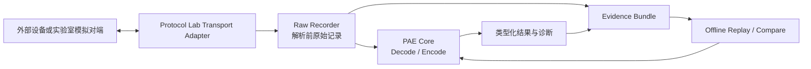

# PAE Protocol Lab Contract V0.1 Draft

## 1. 状态和目的

2026-09-09当前工作树已按[有界变长实施契约](bounded-variable-record-contract.md)接入默认关闭的
Schema 0.8离线链：Result/指纹0.9、Run Record 0.10，Event 0.7和CLI封装0.1保持不变。
Values 0.1～0.4保持原接受域；只有Schema 0.8可使用Values 0.5显式表达空BYTES。
成功和失败Bundle均要求`--record-root`，原配置Replay A/B可读且失败执行状态不被比较EQUAL
覆盖；跨代Run Compare及混代自洽证据失败关闭。实际Windows离线证据见
[专项报告](windows-msvc-2026-bounded-variable-record-slice.md)。普通UDP、UI、历史Bundle、
旧指纹及真实设备能力不升级；当前工作树尚待总控审查。

Result 0.9对空BYTES的唯一合法配对为`raw_value=""`、`logical_value=""`且
`enum_known=false`，Writer、Reader与确定性指纹共用该版本化校验。Result 0.8及更旧代不放宽。
Values 0.5仅在0.4上扩展显式`{"kind":"BYTES","hex":""}`；旧Schema、Values 0.4、
缺失`hex`和`hex:null`仍失败关闭。下限大于0的空载荷仍由Core返回
`BYTES_LENGTH_MISMATCH`，不把空Frame伪造为成功。

2026-09-09收口同步：[长度字段确认契约](length-field-minimal-contract.md)已在当前工作树接入
Schema 0.7、Result/指纹0.8和Run Record 0.9；Event 0.7、Values 0.1～0.4和CLI封装0.1不变。
`COMPUTED_FIELD_OVERRIDE`与`LENGTH_MISMATCH`只允许出现在Result 0.8；成功和失败Bundle均经完整
Reader读取并支持链式Replay，跨代Run Compare在指纹比较前拒绝。覆盖失败的Values输入索引
强绑定及相关补测已通过总控定向复核；初次39/39与修复后4/4、最后CLI 1/1是不同Windows批次。
A组已本地提交为`0179abc`，B组入口文档待提交，全部尚未Push。未增加网络或阶段事件。
Windows执行证据见[长度字段验证报告](windows-msvc-2026-length-field-slice.md)。以下内容保留历史时点。

2026-09-08 C3按已确认的第22节完成限定实现和Windows离线自动化验证。现有
`pae_protocol_lab`在显式`PAE_ENABLE_PROTOCOL_LAB_SCHEMA_V05=ON`专用构建中分派Schema 0.5及
Record 0.7；新链强制记录、禁止Replay替换配置，并以独立`pae.lab.cli/0.1`封装表达进程退出、
期望匹配、比较和原Result。Debug/Release C3专项各2/2、排除UDP的完整离线矩阵各35/35通过；
默认旧Lab、Testing-off及Product-only隔离保持。七项人工离线验收仍为`NOT_EVALUATED`，详见
[C3验证报告](windows-msvc-2026-dec042b-lab-c3-cli.md)和
[人工验收单](manual-dec042b-c3-offline-acceptance.md)。本记录不升级网络、Golden、硬件、现场、
Linux、Oracle、性能或生产证据。

2026-09-08 C2第二段已按确认的第21节完成限定实现：C执行层在底层0.7 Reader之后执行Plan关联，
Inspect Replay使用父Result指定Pipeline且只查询一次；Replay保存父Record/历史Result快照及父子
材料绑定，独立Compare只读且不调用Codec。Debug/Release专项各2/2、完整离线矩阵各22/22通过，
详见[第二段报告](windows-msvc-2026-dec042b-lab-v07-replay-compare-stage-c2-second.md)。普通CLI、C3、
网络及退出码仍未开放，当前待总控复核。

同日总控复核纠错补齐历史父Record/Result与当前记录一致的角色集合和执行关系校验，并限定
`BYTES_LENGTH_MISMATCH`只能归属于BYTES字段及BYTES输入。父快照仍不递归读取祖先、不执行Codec，
也不增加签名或来源认证保证；修复后的双配置专项及完整离线矩阵结果见同一第二段报告。

2026-09-08 C2第一段已完成限定实现和Windows验证：C执行RUN使用Record/Event 0.7，继续绑定
Values 0.4、Result/指纹0.6和原始输入；事件来自C1实际阶段边界，Writer完整自读后无覆盖发布，
Reader严格校验包内结构和关联。后续Reader P2纠错补齐成功Inspect对结构`OK/ONE`的授权、
RAW映射`OK`后`FAILED`的顺序，以及Record operation与Result mode/subject、成功/失败诊断身份的
精确绑定。修复后Debug/Release专项各2/2、相关v06+v07离线测试各5/5通过；P2前完整离线矩阵
各22/22仅作为历史证据，见
[验证报告](windows-msvc-2026-dec042b-lab-v07-run-evidence-stage-c2-first.md)。第一段仍拒绝REPLAY
及非null历史/比较字段，不授予Plan验证或重执行资格；C2第二段、C3、普通CLI和网络未实现。

2026-09-08历史决策记录（C2实施授权前）：C1已随`115db10`、`ef350d5`提交并Push。C2六项方向已确认，
以[DEC-042B第18节](pae-dec-042b-decimal-conversion-contract-draft.md)为权威：C执行Record/Event
改为0.7，Result/指纹仍0.6，Values仍0.4，B合成0.6不变。无Result失败只读诊断、不生成执行指纹。
第19节修订后精确字段、事件、失败映射及两段验收已确认，尚未实施或运行验证。
定向复核后补充主Codec失败且Result映射失败、结构异常、独立终止原因与实际映射事件，
并增加父Record/历史Result快照绑定。完整状态允许集19.8及CLI映射冻结时点19.9均已确认，
CLI映射延至C3实施前冻结。19.10记录Reader前置拒绝与Writer事后发布失败的区别，并补Replay父子
原始输入的长度/Hash绑定；独立Run Compare的等价原文规则不变。本轮无运行验证。
第20节仅为《子任务推进》第一段任务范围，未派发、未授权源码实施或Windows测试。
该修订只覆盖C执行证据；以下旧代及B历史格式规定不被追溯改写。

2026-09-08 C1实施补记：B已随`70cf4ff`、`761ff7f`收口并Push。C阶段12项决策已确认，
权威见[DEC-042B第15节](pae-dec-042b-decimal-conversion-contract-draft.md)。默认关闭的C1隔离目标
现已实现Schema 0.5严格准备、全局结构查询、单次主Codec、Result 0.6自有复制及Encode后独立
Decode复核；准备、结构和Lab复核失败不伪装成Codec结果。B Reader仍无Core/Compiler依赖，
审查纠错后C1按版本分派Values：0.4保持A解析器接受域，0.1～0.3仅接受各代原有类型；
展示Decode的真实`INTERNAL_ERROR`与非法Pipeline等普通复核失败由独立状态区分。
普通Lab及Schema 0.5组合拒绝保持。C1不开放CLI、Evidence、Replay/Compare或网络；C2/C3仍未
实施，第17节事件契约仍待C2前冻结。详见[C1报告](windows-msvc-2026-dec042b-lab-v06-execution-stage-c1.md)。

2026-09-08补记：当前接管基线`1c0617c`，A实现`8d4c7c4`及文档`0c4bc48`均已提交并Push。
B已按[DEC-042B契约第14节](pae-dec-042b-decimal-conversion-contract-draft.md)完成默认关闭的
Evidence 0.6隔离读写与Windows Debug/Release验证；仍不接通普通CLI、不调用Core、Replay/
Compare或网络。详细边界见[B阶段报告](windows-msvc-2026-dec042b-lab-v06-evidence-stage-b.md)。
Reader P2纠错进一步落实整体交付和读前路径门禁：失败不保留任何部分`StoredBundle`，且在读取
清单或负载前拒绝Bundle内符号链接及Windows重解析点；不承诺抵抗检查/打开之间的并发路径替换。
下文旧批次状态保留。

2026-09-07当前状态补记：代码基线为`90c5165`。以下DEC-037～039实施状态与门禁文字保留
当时记录；2026-09-06 NetAssist人工Loopback已完成，仅该模拟场景通过，见
[人工验收报告](windows-protocol-lab-manual-loopback-acceptance-20260906.md)，不升级Golden或硬件证据。
当前Lab支持Values至0.3、Result/Record/Event至0.5，Schema 0.5仍被构建门禁拒绝。
DEC-042B第三段六项补充及A/B/C顺序已确认；A纯格式模块已在默认关闭的隔离测试目标中完成限定
实现，转换格式、错误身份、指纹和版本规则以
[DEC-042B契约第10～13节](pae-dec-042b-decimal-conversion-contract-draft.md)为新增语义权威。
Result 0.6负责转换与失败细节，Record绑定Result，Event保持阶段职责，RX Metadata保持0.2。
普通Lab须等B证据读写和C运行链及兼容验证完成才可接通新代；A不发布Evidence Bundle、不调用
Core或网络，现有Schema 0.5与Protocol Lab组合拒绝保持生效。

本文定义`PAE Protocol Lab（PAE协议实验与复现工具）`首个实现切片的职责、数据记录、
主动发送安全边界和验收门禁。

当前状态：`CONFIRMED / PARTIALLY VERIFIED（已确认、部分验证）`。离线
`inspect/encode/replay/compare`与Evidence Bundle（证据包）已经实现并取得Windows执行证据；
`PAE-DEC-039`的UDP（User Datagram Protocol，用户数据报协议）Exchange Windows源码和
Loopback自动化证据也已形成。由于外部网络调试工具人工门禁尚未执行，整体仍保持部分验证。

Protocol Lab用于：

- 离线检查一条完整报文；
- 使用类型化业务值预览Encode结果；
- 通过工具自有Transport Adapter执行有边界的实验室收发；
- 在调用PAE前记录原始字节，并生成可校验的Evidence Bundle（证据包）；
- 离线Replay（重放）历史记录并比较当前结果；
- 为生产问题复现准备与Transport无关的记录格式。

本文冻结`PAE-DEC-037`首个内部Contract Slice（契约切片），按`PAE-DEC-038`完成离线实现加固，
并按`PAE-DEC-039`实现Windows UDP Exchange，但不是稳定公共API或跨版本文件格式兼容承诺。
离线实现已作为`35ecbccc9e5554fbd8607535e0aa84e59057ef50`提交并Push；本轮UDP实现和验证
文档尚未Stage、Commit或Push。

## 2. 永久边界

### 配套Qt UI方向修订（已确认、未实现）

保留CLI并增加独立Qt UI，两者复用Lab执行能力，不各自实现协议解析、指纹或证据规则。
Qt仅进入可选UI目标，不进入PAE Core依赖链；不装Qt仍应能构建Core、CLI和测试。
UI后台执行及线程由工具层管理，不改变Core被动调用边界。
暂不复制现有Qt包，先核验来源、完整性、工具链、许可证和版本选择；当前未冻结Qt版本。
旧文中的GUI后置不再表示没有UI目标，而是排在当前Lab第三段A/B/C闭环之后。
随后单独开展Qt依赖验证及最小UI切片，实施另行授权。当前没有复制Qt或引入Qt依赖。

Lab第三段指纹精确编码及A阶段纯格式测试入口见
[DEC-042B契约第12～13节](pae-dec-042b-decimal-conversion-contract-draft.md)，A阶段已限定实现并完成
总控复核；B证据读写和C运行链仍未实现。

Protocol Lab是独立工具目标，不改变PAE Core的被动模型：

- Socket、串口或其他通讯资源只由工具层或宿主Adapter持有；
- Core不打开、监听、轮询、关闭或重连任何通讯资源；
- Core不创建线程、定时器或Worker Pool；
- Lab不成为生产业务必须依赖的运行组件；
- Lab不承担路由总线、设备生命周期、可靠投递或业务状态机职责；
- Lab生成或解析自己的数据不能自动成为独立协议证据。

首阶段与现有Conformance Runner的分工如下：

| 组件 | 输入 | 主要输出 | Transport |
| --- | --- | --- | --- |
| PAE Core | Plan、字节、类型化Value | Decode/Encode结果 | 无 |
| Protocol Conformance Runner | 配置和固定Corpus | 确定性一致性结论 | 无 |
| Protocol Lab | 配置、单帧、记录或实验端点 | 人类可读诊断和Evidence Bundle | 工具层可选 |

## 3. 架构关系



该图只表达职责和数据顺序。当前仅完成文本结构检查，尚未执行Mermaid实际渲染。

## 4. 工具和仓库形态

首阶段可执行目标确认为`pae_protocol_lab`，代码位于：

```text
tools/protocol_lab/
```

公共API尚未稳定前，Protocol Lab与PAE同仓开发，以避免为了跨仓链接而提前冻结内部接口。
稳定C++ API和C ABI（C应用程序二进制接口）形成后，再评估是否拆分独立仓库。

已新增独立CMake开关：

```cmake
PAE_BUILD_PROTOCOL_LAB=OFF
```

该开关默认关闭。打开后构建Lab及其所需的内部ProtocolPlan、Config Compiler和Codec，但不
静默修改其他CMake Cache开关；它不要求`PAE_BUILD_TESTING=ON`。只有Lab与Testing同时打开时，
才注册Lab自动化测试。

Protocol Lab不安装、不导出，也不进入默认Product-only构建；开关不得改变PAE Core静态库
内容。未来若改变交付属性，必须另行拍板。

## 5. 首个CLI模式

首个实现范围包含以下CLI（Command-Line Interface，命令行接口）模式。名称属于V0.1内部契约，
尚不是稳定公共命令行兼容保证。

通用形式为：

```text
pae_protocol_lab <command> [options]
```

通用参数为：

```text
--config <protocol.pae.json>
--output text|json
--record-root <directory>
--expect-status <status>
--help
--version
```

默认`--output text`供人工查看；`--output json`输出机器可读结果。正常结构化结果写入`stdout`，
过程日志和非结构化诊断写入`stderr`。未知参数、重复单值参数、缺失参数和互斥参数同时出现均
作为CLI错误拒绝，不能通过参数顺序改变含义。

### 5.1 `inspect`

读取严格JSON配置和一条Hex或Binary完整报文，调用形式为：

```text
pae_protocol_lab inspect --config <file> (--frame-bin <file> | --frame-hex <file>)
```

两种Frame参数必须且只能出现一个。Hex输入只允许十六进制字符和ASCII空白，不允许`0x`前缀、
逗号、冒号或注释；非空白字符数必须为偶数。规范化输出统一为大写、无分隔符Hex。首版不接受
把长Frame直接写入命令行参数。

输出：

- 配置编译状态；
- Pipeline和Message匹配结果；
- 类型化字段、Raw Value和Logical Value；
- Decode状态、失败字段和诊断；
- 可选Evidence Bundle。

### 5.2 `encode`

读取类型化Values文件，输出预览字节和字段写入结果：

```text
pae_protocol_lab encode --config <file> --values <values.pae-lab.json>
```

Values V0.1示例：

```json
{
  "format_version": "pae.lab.values/0.1",
  "pipeline_id": "lab_to_device",
  "message_id": "lab_command",
  "fields": [
    {
      "id": "sequence",
      "kind": "UINT64",
      "uint64": "42"
    },
    {
      "id": "payload",
      "kind": "BYTES",
      "hex": "10203040"
    },
    {
      "id": "mode",
      "kind": "ENUM",
      "entry_id": "active"
    }
  ]
}
```

`UINT64`使用规范十进制字符串：不允许正号、空白、指数、小数或除零之外的前导零。`BYTES`
使用大写、偶数长度、无分隔符Hex；`ENUM`使用稳定`entry_id`。Constant和Computed字段不得由
Values覆盖。未知字段、重复字段、类型错误、越界和跨Message引用全部失败关闭。

Values内的Pipeline和Message是权威绑定；CLI不得静默覆盖。默认不发送，只有显式进入受控
Transport模式时才允许把字节交给Socket。

### 5.3 `replay`

读取一个既有Evidence Bundle，默认使用其中内嵌配置重新执行，并把当前结果与历史结果比较。
允许显式指定新配置，但必须标记`cross_config_replay=true`，生成新的Run且不得覆盖旧Bundle。
对`ENCODE_TX`，Replay Result的`frame_*`及`REPLAY FRAME`表示本次实际Encode输出；`tx_frame_*`
保留源UDP历史TX检查点。Cross-config产生不同字节是合法的`DIFFERENT`，不得按证据损坏拒绝。
再次Replay该差异Bundle时，当前执行与上一份Replay的确定性指纹比较，而历史TX检查点继续保持
不变。Encode失败允许本次`frame_*`为空，但必须保留真实失败状态、诊断和历史TX，不能伪造成功。
Inspect Replay在调用Codec前必须按本次成功编译的Plan重新执行Frame资源门禁：同配置应重新产生
相同超限失败，替换配置则采用替换后Plan的上限。资源失败时不调用Codec；即使确定性比较为
`EQUAL`，当前执行仍是失败，Replay退出码仍按当前执行状态决定。

### 5.4 `compare`

逐字节和逐字段比较两个Frame或两个Run，区分：

- Wire字节差异；
- Message匹配差异；
- 类型和逻辑值差异；
- 状态与诊断差异；
- 只影响记录环境、不参与协议判定的元数据差异。

确定性比较包括原始Frame、Message匹配、Codec状态、类型化字段、Raw/Logical Value、Encode输出
和稳定诊断标识；时间、绝对路径、Run ID、进程ID及本地临时端口不参与相等性判定。

离线切片的精确调用形式为：

```text
pae_protocol_lab compare \
  (--left-run <run> --right-run <run> | \
   (--left-frame-bin <file> | --left-frame-hex <file>) \
   (--right-frame-bin <file> | --right-frame-hex <file>))
```

Run差异通过`comparison_categories`区分`OPERATION_KIND`、`CONFIG`、`WIRE_BYTES`、
`MESSAGE_MATCH`、`STATUS`、`TYPED_FIELDS`、`STABLE_DIAGNOSTIC`和兜底的
`DETERMINISTIC_FINGERPRINT`。Frame比较只比较规范化后的字节，可混合Binary和Hex输入。

### 5.5 `udp-exchange`

通过工具自有UDP Adapter执行一次有边界的请求/响应实验：

```text
pae_protocol_lab udp-exchange \
  --config <file> \
  --values <file> \
  [--local <ipv4:port>] \
  --remote <ipv4:port> \
  --receive-pipeline <id> \
  [--timeout-ms <value>] \
  --record-root <directory> \
  [--send [--allow-non-loopback]]
```

- 显式配置本地和远端Endpoint；
- 默认只预览请求，显式确认后才发送；
- 默认单次发送，不自动重试；
- 接收数量、报文长度和等待时间均有上限；
- 在Socket发送前持久化最终TX字节；
- 在Decode之前持久化收到的原始UDP Payload；
- 无响应、截断、未知Message和解析失败均形成明确记录，不伪造成功。

第一版只接受数字IPv4地址，不执行DNS。本地地址默认`127.0.0.1:0`，远端必须显式填写；没有
`--send`时不得创建Socket，只执行配置、Encode和安全预览。非Loopback地址必须同时提供
`--send --allow-non-loopback`。远端端口不得为`0`；拒绝广播、组播、未指定远端和远端
`0.0.0.0`，不允许自动扫描或后台持续接收。首个Windows切片固定发送一次并至多接收一个
Datagram（数据报），不自动重试。

首阶段不实现TCP、串口、CAN、原始网卡监听、自动设备扫描、压力发生器或GUI。

## 6. I/O和空闲行为

UDP首切片采用工具层同步阻塞等待或等价事件等待，并配置有限超时；没有报文时不得以无休止
忙轮询占用CPU。

Windows Adapter可使用系统Winsock；未来Linux Adapter使用POSIX Socket。平台代码必须位于
工具Adapter边界，不得进入ProtocolPlan、Codec或公共Core头文件。

Windows实现通过内部、不可安装且不可导出的`IUdpExchangeAdapter`边界隔离。生产实现使用RAII
（资源获取即初始化）管理Winsock启动、Socket和清理；测试可注入受控Adapter，但真实Loopback
自动化必须实际经过Winsock。产品路径不创建常驻线程；测试专用对端线程必须具有明确的就绪、
停止、超时和回收边界。

第一版不为了统一Socket API引入Qt、Boost或其他大型框架。若未来选择轻量第三方库，必须单独
记录版本、License、源码范围和引入理由。

## 7. Evidence Bundle V0.1/V0.2/V0.3/V0.4

每次Lab执行产生一个独立且不可原地覆盖的Run目录：

```text
run_<utc-time>_<run-id>/
├── inputs/
│   ├── protocol.pae.json
│   └── values.pae-lab.json
├── frames/
│   ├── 000001_tx.bin
│   ├── 000001_tx.hex
│   ├── 000002_rx.bin
│   └── 000002_rx.hex
├── run_record_v0.2.json
├── events_v0.2.jsonl
├── result_summary_v0.2.json
├── SHA256SUMS
└── COMPLETE
```

在线证据型运行中，最终TX字节必须在Socket发送前成功写入Run记录，RX原始字节必须在
PAE Decode前成功写入Run记录。TX记录失败时不得发送，RX记录失败时不得Decode；首个Windows
UDP切片不提供绕过该失败关闭语义的非证据型诊断参数。

上述目录展示UDP V0.2；RX同时包含`frames/000002_rx.meta.json`，绑定事件编号、来源Endpoint、
方向、字节长度和SHA-256。既有离线`inspect/encode/replay/compare`继续写入并读取V0.1；读取器
只接受明确支持的V0.1/V0.2。旧UDP V0.1草案记录不能证明应重放TX Encode还是RX Decode，必须
以`PAE_LAB_REPLAY_EVIDENCE_INSUFFICIENT`拒绝，不允许猜测；未知格式版本同样失败关闭。

默认复制本次实际使用的配置和Values文件，保证离线Replay。Bundle按以下流程完成：

1. 创建`run_<id>.inprogress/`；
2. 单个文件先写临时文件，关闭后重新读取并核对长度与SHA-256，再重命名为正式文件；
3. TX固定执行`Encode → 保存并复核TX → Socket就绪 → SEND_INTENT → Socket发送 → SEND_RESULT`；
4. RX固定执行`Socket接收 → 保存并复核RX字节和来源Metadata → Peer检查 → PAE Decode → 记录结果`；
5. 全部文件关闭并复核后生成`SHA256SUMS`和`COMPLETE`；
6. 最后把`.inprogress`目录重命名为正式Run目录。

`COMPLETE`只表示Evidence Bundle事务完整，不表示网络交换或协议操作成功。超时、Socket错误、
未知Message或Decode失败只要被完整记录，仍可发布带失败终态的正式Run；Evidence Bundle记录
失败或进程中断才保留`.inprogress`。

失败或崩溃留下`.inprogress`目录，不自动删除；没有`COMPLETE`的目录只能用于人工恢复分析，
不能作为完整Evidence Bundle。V0.1不承诺断电级持久化，也不要求每个文件调用系统级
`fsync`或`FlushFileBuffers`。

V0.2 Event在事件实际发生处即时采集，全部使用同一Run单调时钟原点并保持非递减；
`Complete()`只序列化已采集事件。启动、Socket创建或绑定失败没有`SEND_INTENT/SEND_RESULT`；
`SEND_RESULT`只记录发送调用本身的成功或稳定诊断，不携带后续接收终态。

UDP V0.2 Replay显式采用下列一种模式：

| 模式 | 当前执行 | 比较语义 |
| --- | --- | --- |
| `ENCODE_TX` | 使用记录Values重新Encode TX | 与历史可复现协议结果比较 |
| `DECODE_RX` | 使用绑定的Receive Pipeline重新Decode完整RX | 与历史可复现协议结果比较 |
| `NO_CODEC_REEXECUTION` | 只验证证据完整性，不调用Codec | `comparison_equal=null`、`NOT_EVALUATED` |

历史Endpoint、超时、发送/接收状态及Transport诊断只进入`historical_transport`；当前Codec执行
状态、稳定诊断和比较结论使用独立字段，离线Replay绝不重新打开Socket。

离线Replay顶层`response_received=false`表示本次没有执行网络接收，不覆盖历史值；
`response_decoded`只表示本次是否实际成功Decode RX。保存的TX/RX字节及当前重放主体由显式模式
和主体字段绑定，不能再以顶层网络状态推断，因此Replay产物自身必须可继续Replay。对成功、错误
响应、Peer不匹配、超长、截断和零长度响应，至少验证“原始Run→Replay A→Replay B”。

Bundle读取必须同时执行三层一致性校验：

1. `SHA256SUMS`要求同版本Result、Event、Run Record、配置、Frame和`COMPLETE`完整出现；
2. Run Record按V0.1/V0.2严格解析对象、必需字段、字段类型和`recorded_payload_files`，并与
   Result的Command、终态、Transport、收发状态及V0.2模式、主体、Receive Pipeline和当前执行/
   比较状态对照。真正的旧离线V0.1只要求其发布时已有字段；后加Endpoint、发送结果和响应状态
   字段允许缺失，存在时仍严格校验类型和一致性，不据缺失字段补造历史事实；
3. V0.2 Event按事件种类严格校验结构和时序。原始UDP的TX/RX Event绑定Result、Metadata和实际
   字节，发送结果不得先于意图；离线Replay只记录一个绑定本次`frame_*`实际输出的
   `REPLAY FRAME`。历史TX/RX仍作为独立比较参考，不冒充本次输出。

缺失Record、非法JSON、未知Record版本、Record/Result矛盾，或Event跨文件关联字段不一致时，
即使各文件Hash和清单已被同步重算，也必须失败关闭。

`SHA256SUMS`不包含自身，但包含空`COMPLETE`标记；它使用小写Hex、两个ASCII空格和以`/`
表示的相对路径，条目按路径升序排列。Replay和Run Compare在读取结果前重新核对完整清单；
Hash不符、路径逃逸、清单乱序、未列入清单的额外文件、符号链接或缺少必需文件均失败关闭。

### 7.1 Schema 0.2与Lab 0.3

`PAE-DEC-040`增加下列明确版本组合，不改变历史文件：

| 执行配置 | Values | Result / Record / Event | RX Metadata |
| --- | --- | --- | --- |
| Schema 0.1 | Values 0.1，或只含旧类型的0.2 | 原离线0.1／UDP0.2 | UDP时0.2 |
| Schema 0.2 | Values 0.1（无BOOL输入时）或0.2 | 统一0.3 | UDP时仍为0.2 |

Values 0.2使用原生JSON布尔`{"id":"enabled","kind":"BOOL","bool":true}`，拒绝数字和
字符串替代。0.3 BOOL结果固定为`kind=BOOL`、`raw_value="0"/"1"`、
`logical_value="false"/"true"`和`enum_known=false`，读取端严格校验配对。
Evidence Bundle读取端同时按格式契约严格校验所有类型化字段：只接受`UINT64`、`BYTES`、
`ENUM`及0.3中的`BOOL`；UINT64须为规范十进制且Raw/Logical相等，BYTES须为规范大写偶数Hex，
ENUM须满足known/unknown对应关系。字段类型、Raw/Logical或`enum_known`内部矛盾时，即使文件长度、
Run Record与清单Hash均已同步也拒绝读取。Replay的`comparison_equal=true`必须同时满足确定性指纹
相等且没有确定性差异分类，不能与`TYPED_FIELDS`等类别并存。

0.3指纹带独立版本域；0.1/0.2旧指纹算法和固定历史样本不重算。首批明确拒绝Schema 0.1与0.2
双向替换配置Replay，以及旧格式Run与0.3 Run直接Compare；原始Frame比较仍按实际字节允许。

### 7.2 Schema 0.3与Lab 0.4

Schema 0.3执行统一产生`pae.lab.result/0.4`、`pae.lab.record/0.4`和
`pae.lab.event/0.4`，即使目标Message没有配置`integrity`。Values继续使用0.1/0.2，BOOL仍只在
Values 0.2中以原生JSON布尔表示；RX Metadata语义不变，继续使用0.2。

SUM8接收失败映射为`INTEGRITY_FAILED`和`PAE_LAB_CODEC_INTEGRITY_FAILED`，当前执行退出5且
不交付字段。同代Replay必须重新执行校验；即使比较为`EQUAL`，当前执行失败仍保持退出5。
0.4使用独立指纹域；旧结果、记录、事件、指纹算法和固定夹具不迁移、不重写。跨Schema替换
配置Replay及跨代Run Compare在协议差异比较前拒绝，原始Frame比较仍允许跨代。

结构候选选择发生在SUM8之前，跨Pipeline也不能只统计Decode成功项。`NO_CODEC_REEXECUTION`
保持当前执行与比较`NOT_EVALUATED`，不伪造完整性通过；Bundle SHA-256验证证据文件内部绑定，
SUM8验证协议Frame覆盖范围，两者职责互不替代。
同代Replay保留三种模式、历史Transport隔离、跨配置差异和链式再次Replay。未知版本、Result/
Record/Event混合代际或内部关联不一致，即使Hash清单自洽也必须失败关闭。

### 7.3 Schema 0.4与Lab 0.5

Schema 0.4统一产生Result/Record/Event 0.5并进入独立`pae.lab.fingerprint/0.5`域，即使消息没有
INT64。Values 0.3新增`INT64`规范十进制字符串；它只可配Schema 0.4，Schema 0.4仍可使用旧Values
表达旧类型，BOOL至少需要Values 0.2。INT64结果的raw/logical必须相同、规范且在INT64范围内；
Evidence读取在文件长度和Hash自洽后仍严格拒绝未知kind及非法INT64元组。RX Metadata保持0.2。

跨代Run Compare和替换配置Replay继续在协议差异前拒绝；同代链式Replay、跨配置差异、失败执行
状态和历史Transport隔离沿用既有语义。旧Result/Record/Event及指纹算法不迁移、不重算。

`run_record_v0.1.json`至少记录：

- Record格式版本和Run ID；
- Tool版本、PAE版本或源码Revision；
- 配置文件SHA-256和可用时的Plan检查点；
- 执行模式、启动时间和结束状态；
- Transport类型及经保密处理的Endpoint元数据；
- 最大Frame、接收数量、超时和主动发送参数；
- 操作者声明的证据等级、Peer类型和敏感性；
- 生成文件及其SHA-256。

`events_v0.1.jsonl`每行记录一个有序事件，至少包含：

- 单调递增Event ID；
- `TX`、`RX`或`REPLAY`方向；
- 原始Frame文件、长度和SHA-256；
- Frame Origin（来源类型）和Peer Kind（对端类型）；
- Pipeline、Message和Direction匹配结果；
- Decode/Encode状态；
- 类型化字段、Raw Value和Logical Value；
- 诊断及其稳定标识；
- 墙钟时间和单调时间，仅用于诊断，不进入Golden字节比较。

三种JSON记录均使用UTF-8、无BOM和LF换行；JSON Document使用固定字段顺序，JSONL每行一个
完整对象。当前内部Schema默认拒绝未知字段，未来格式变更必须升级`format_version`，不得静默
改变既有V0.1语义。

## 8. 机器输出和退出码

机器输出格式标识为：

```text
pae.lab.result/0.1
```

结果至少包含`format_version`、Command、Operation Status、Exit Code、配置SHA-256、Protocol、
Pipeline、Message、Direction、输入Frame长度与SHA-256、类型化字段、Encode输出、稳定诊断、
Evidence Bundle路径、Transport、实际/配置Endpoint、TX/RX字节与Hash、超时、
`send_attempted`、`send_succeeded`、`response_received`、`response_decoded`和三层Gate状态。

进程退出码冻结为：

| Exit Code | 含义 |
| ---: | --- |
| `0` | 操作成功，或实际状态与`--expect-status`一致 |
| `2` | CLI用法或参数错误 |
| `3` | 输入文件或路径错误 |
| `4` | 配置编译失败 |
| `5` | Decode/Encode等协议操作失败或与期望状态不一致 |
| `6` | Compare发现差异 |
| `7` | Evidence Bundle记录失败 |
| `8` | Transport打开、绑定、发送或接收失败 |
| `9` | 等待响应超时 |
| `10` | 内部错误或未分类异常 |

未提供`--expect-status`时，Codec非`OK`返回`5`；指定期望状态后，实际状态一致返回`0`，不一致
返回`5`。Compare发现差异固定返回`6`。所有未处理C++异常必须在`main()`边界转换为`10`，不得
越过进程入口。

若Evidence Bundle记录失败，机器结果必须先把状态、稳定诊断、Evidence Bundle路径和退出码
更新到失败终态，再重新计算确定性指纹并输出；不得保留记录失败前的成功状态指纹。

Windows UDP切片冻结以下稳定诊断标识：

- `UDP_STARTUP_FAILED`；
- `UDP_SOCKET_CREATE_FAILED`；
- `UDP_BIND_FAILED`；
- `UDP_SEND_FAILED`；
- `UDP_RECEIVE_FAILED`；
- `UDP_RESPONSE_TIMEOUT`；
- `UDP_PEER_MISMATCH`；
- `UDP_DATAGRAM_TOO_LARGE`；
- `UDP_DATAGRAM_TRUNCATED`；
- `UDP_PLATFORM_UNSUPPORTED`。

前五项、Peer不匹配、超长、截断和平台不支持映射退出码`8`；响应超时映射`9`。UDP交换完成后
的Decode或期望状态失败仍映射`5`，Evidence Bundle自身失败仍映射`7`。

## 9. 来源标签和证据语义

Frame Origin与证据等级正交，不增加新的证据等级。

首阶段Frame Origin候选：

- `PAE_GENERATED`：由当前PAE Encode产生；
- `REFERENCE_GENERATED`：由独立参考实现产生；
- `OBSERVED_EXTERNAL`：从独立外部端点边界观察；
- `MANUAL_SYNTHETIC`：人工输入或拼接；
- `REPLAYED`：来自既有Run重放。

首阶段Peer Kind候选：

- `LAB_SIMULATED_PEER`：网络调试工具或人工模拟对端；
- `EXTERNAL_DEVICE`：经人工确认的外部设备；
- `PRODUCTION_ENDPOINT`：经人工确认的既有生产发送或接收端；
- `OFFLINE_FILE`：无在线对端的文件输入。

证据规则：

- 网络调试工具发送的人工Frame属于`LAB_SIMULATED_PEER`，通常为`SYNTHETIC_REVIEWED`
  或`DOCUMENT_DERIVED_REVIEWED`；
- Frame经过真实UDP Socket传输不会自动变成`OBSERVED_CAPTURE`；
- PAE生成并由PAE解析的Frame只能支持Engine PoC（引擎概念验证）；
- PAE生成请求后由真实设备返回的响应可成为`OBSERVED_CAPTURE`候选，但仍需来源确认和独立复核；
- 从既有生产发送边界独立捕获的请求可成为`OBSERVED_CAPTURE`候选；
- Lab不得自动修改Corpus的`authority_level`或`review_status`。

在线UDP响应必须记录实际来源IPv4和端口。首个Datagram来源与配置远端不一致时，先保存完整
原始字节和来源，再以`UDP_PEER_MISMATCH`失败；不得静默丢弃并继续等待。接收缓冲区必须覆盖
合法IPv4 UDP Payload，完整接收后再执行ProtocolPlan长度限制。超长、截断或无法证明完整的
Datagram不得进入Decode。

## 10. 三层验收门禁

Protocol Lab引入后，三个门禁必须分别报告：

| Gate | 含义 | Lab自身能否关闭 |
| --- | --- | --- |
| `ENGINE_POC_PASS` | 配置、Plan和Codec在当前语料上正确执行 | 可以 |
| `LAB_EXCHANGE_PASS` | 与实验室模拟对端完成真实Socket收发、记录和重放 | 可以 |
| `PROTOCOL_GOLDEN_PASS` | Frame具有协议契约或真实设备独立证据 | 不一定 |

`LAB_EXCHANGE_PASS`至少要求：

- Lab成功预览并显式发送一条请求；
- 模拟对端收到的字节与预期逐字节一致；
- 模拟对端发送一条响应；
- Lab在Decode前保存完整原始字节；
- Decode结果与人工期望一致；
- Evidence Bundle的SHA-256清单完整；
- 离线Replay结果与在线处理结果一致；
- 超时和错误报文路径不产生虚假成功。

`LAB_EXCHANGE_PASS`不得在报告、日志或文档中改写为设备互通、现场验证或Protocol Golden。

## 11. 主动发送安全边界

- 默认只预览，不发送；
- 必须使用明确的主动发送确认参数；
- 必须显式给出目标地址和端口；
- 默认只允许一次发送；
- 不自动重试、不自动广播、不扫描局域网；
- 后续批量模式必须单独增加速率、数量和总字节预算；
- 运行摘要必须记录是否实际调用发送；
- 公共样例不得包含真实Endpoint、设备编号、抓包或现场信息；
- 原始记录默认按敏感数据处理，不自动进入Git。

## 12. 生产复现边界

未来生产系统可通过可选Trace Adapter（追踪适配层）输出兼容Evidence Bundle的数据，再由Lab
离线Replay。生产进程不运行完整Lab，也不让Lab进入实时业务必经路径。

生产Trace至少需要容量限制、文件轮转、敏感信息策略、宿主控制的写入和磁盘失败隔离；这些
能力依赖未来稳定Runtime和诊断接口，不属于Protocol Lab首切片。

## 13. 资源上限

以下数值是Protocol Lab内部V0.1限制，不升级为PAE公共Runtime合同：

| 资源 | 默认值 | Hard Limit（硬上限） |
| --- | ---: | ---: |
| 请求发送次数 | `1` | `1` |
| 最大接收Frame数 | `1` | `16` |
| 响应超时 | `2000 ms` | `60000 ms` |
| 单Run最大Event数 | `64` | `256` |
| 单Run原始Frame总字节 | `1 MiB` | `16 MiB` |
| IPv4 UDP Payload | Plan与UDP Adapter两者较小上限 | `65507 bytes`且不超过Plan Profile |

所有上限必须在分配、创建目标文件或发送前检查；乘加采用受检运算。超限时不得发送，也不得
生成`COMPLETE`。CLI不能关闭Hard Limit；未来压力测试工具不得复用本模式静默扩大资源。

首个Windows UDP切片固定至多接收一条响应。表中的`16`条接收Hard Limit只作为未来经单独拍板
的多接收模式上界，当前CLI不可达。

## 14. 分阶段实施

1. `Contract Slice（契约切片）`：本文冻结CLI、记录Schema、来源标签、错误和安全边界；
2. `Offline Replay Slice（离线重放切片）`：已实现CLI基础、`inspect/encode/replay/compare`、
   Evidence Bundle、模块拆分和文件系统故障注入测试；
3. 已完成Windows Debug/Release构建与测试；Lab专用均`4/4 PASS`、全切片共存均`30/30 PASS`；
   审查、Commit和Push保持独立步骤；
4. `UDP Exchange Slice（UDP实验切片）`：`PAE-DEC-039` Windows单次收发、原始记录和
   Loopback自动化已实现；
5. 使用外部网络调试工具执行人工`LAB_EXCHANGE_PASS`；
6. `Golden Candidate Export Slice（黄金候选导出切片）`：只生成待人工复核候选，不自动升级证据；
7. TCP、串口、GUI、压力工具和生产Trace分别另行拍板。

每个切片的源码修改、构建验证、Commit和Push均保持独立授权。

## 15. 自动化和人工验收

Offline Replay Slice的CTest至少覆盖：

- `inspect`正常、未知Message、歧义和错误Frame；
- `encode`逐字节结果及Values缺失、重复、类型错误和越界；
- Replay使用内嵌配置并生成新Run；
- Cross-config Replay显式标记且不修改旧Bundle；
- Compare相同返回`0`、不同返回`6`；
- 全部退出码和`--expect-status`语义；
- Bundle文件Hash、排序清单、`COMPLETE`和故障后的`.inprogress`保留；
- 记录失败不会交付虚假成功；
- Product-only构建不生成Lab；
- 现有CTest不回退。

UDP Exchange Slice按`PAE-DEC-039`覆盖：默认无`--send`不创建Socket、真实Winsock Loopback
单次收发、TX/RX记录顺序、超时、Transport各阶段错误、非Loopback双确认、非法Endpoint、Peer
不匹配、超长/截断、数量/Event/总字节超限和解析前原始记录。自动化测试可使用测试专用阻塞
Peer或注入Adapter，但测试线程必须有界，且不能把测试设施作为协议权威。

人工门禁使用外部网络调试工具接收Lab请求、逐字节核对、发送人工响应，再关闭在线工具执行
离线Replay。自动化和人工门禁均通过后才允许声明`LAB_EXCHANGE_PASS=PASS`；该结论仍不得升级
`PROTOCOL_GOLDEN_PASS`。

## 16. 首个源码切片排除项

最初的Offline Replay Slice没有实现UDP；后续仅按`PAE-DEC-039`增加Windows UDP单次Exchange。
TCP、串口、CAN、GUI、生产Trace、Golden自动升级、Runtime、Session、C ABI、Linux、安装导出
或正式性能Benchmark仍未实现。任何扩张必须单独拍板。

### 16.1 `PAE-DEC-038`离线加固边界

离线实现已拆分为应用编排、CLI、协议操作、Evidence Bundle、结果格式、SHA-256和共享内部类型。
它们组成不安装、不导出的`pae_protocol_lab_internal`静态目标，并最终只交付现有
`pae_protocol_lab`可执行程序。拆分不改变命令、参数、Values格式、结果字段、退出码、差异类别
或Evidence Bundle目录结构。

Evidence Bundle写事务使用内部`RecordFileSystem`依赖注入接口。自动化通过显式测试对象覆盖
Run目录创建确认、第N次写入、关闭、重读、长度/内容/Hash复核、`COMPLETE`、`SHA256SUMS`和
最终目录重命名失败；不新增隐藏CLI或环境变量。全部注入场景由应用层返回`7`，不产生正式Run，
并在目录已经创建的前提下保留`.inprogress`。若操作系统从一开始就禁止创建目录，则没有物理
目录可保留，但仍必须失败关闭且不得伪造完整Run。

### 16.2 `PAE-DEC-039` Windows UDP Exchange实现边界

第二十三轮确认UDP只属于Protocol Lab工具层。内部`IUdpExchangeAdapter`表达打开、绑定、发送、
有限等待、接收和关闭，Windows生产实现使用Winsock；接口和实现均不安装、不导出。PAE Core、
ProtocolPlan和Codec不感知Socket、Endpoint或Windows类型。

`udp-exchange`采用一次同步、有界操作，不忙轮询、不创建产品级常驻线程。无`--send`只执行
配置、Encode、预览和记录，不能初始化Winsock或创建Socket；非Loopback主动收发必须具备
`--send --allow-non-loopback`双确认。接收第一个Datagram后先记录原始字节及来源，再检查Peer
并Decode；来源不一致、超长、截断或无法证明完整均失败关闭。

Windows Debug/Release自动化至少覆盖无`--send`零Socket操作、真实Winsock Loopback单次收发、
TX/RX逐字节结果和记录顺序、超时、Transport各阶段错误、非Loopback双确认、非法Endpoint、
Peer不匹配、超长/截断、错误响应的完整证据、记录失败、Product-only和既有CTest不回退。测试
专用对端线程必须有有界生命周期，且不构成协议权威。

人工验收使用外部网络调试工具完成Loopback请求、逐字节核对、响应、Evidence Bundle复核和
离线Replay。自动化与人工门禁都通过后才允许报告`LAB_EXCHANGE_PASS=PASS`；Peer仍标记为
`LAB_SIMULATED_PEER`，不得据此升级`PROTOCOL_GOLDEN_PASS`。

本Decision当前状态为`IMPLEMENTED / WINDOWS_AUTOMATED_VERIFIED（已实现、Windows自动化已
验证）`。TCP、串口、CAN、持续监听、重试、多客户端、压力测试、GUI、生产Trace、Linux实现、
Runtime、Session、Route、公共C ABI、真实设备、硬件、现场验证和Golden Candidate自动升级
均不在本切片。

### 16.3 Schema 0.6 CRC离线证据代际

Schema 0.6离线执行统一产生Result 0.7、确定性指纹0.7和Run Record 0.8；该选择由已成功编译的
配置代际决定，与Message是否实际配置CRC无关。Event保持0.7阶段语法，CLI封装保持0.1，RX
Metadata仍保持0.2。新代文件名为`result_summary_v0.7.json`、`run_record_v0.8.json`和
`events_v0.7.jsonl`，历史父记录使用相同新代Record/Result文件名。

同代成功或完整性失败Bundle均须可读取和链式Replay。CRC失败Replay可比较为`EQUAL`，但当前
执行仍是`INTEGRITY_FAILED`并保持退出5；这不等于执行成功。Schema 0.5与0.6的Run Compare在
指纹比较前拒绝，不伪造协议差异；原始Frame比较保持跨代可用。旧Result 0.6、Record 0.7、
指纹算法及历史夹具不重写。详细验证见
[`windows-msvc-2026-crc-minimal-slice.md`](windows-msvc-2026-crc-minimal-slice.md)。

## 17. 当前未验证范围

- CLI名称和JSON字段已有内部实现，但尚未形成公共兼容性承诺；
- 已执行Windows离线记录、Hash复核、Replay以及UDP Loopback请求/响应和超时自动化；外部网络
  调试工具人工Loopback门禁尚未执行，因此`LAB_EXCHANGE_PASS=NOT_EVALUATED`；
- 退出码`8/9`和UDP稳定诊断已有自动化运行路径；未分类异常的退出码`10`已在`main()`边界实现，
  但没有故意制造未定义异常的自动化用例；
- `.inprogress`保留和失败关闭语义已由8类文件系统故障注入覆盖；尚未覆盖断电、进程强杀、
  文件系统缓存持久化或真实磁盘故障；
- 未测量记录开销、磁盘失败、峰值内存或长时间稳定性；
- 未执行Linux、真实设备、硬件或现场验证；
- 当前没有任何真实协议因此文档取得Protocol Golden资格。
